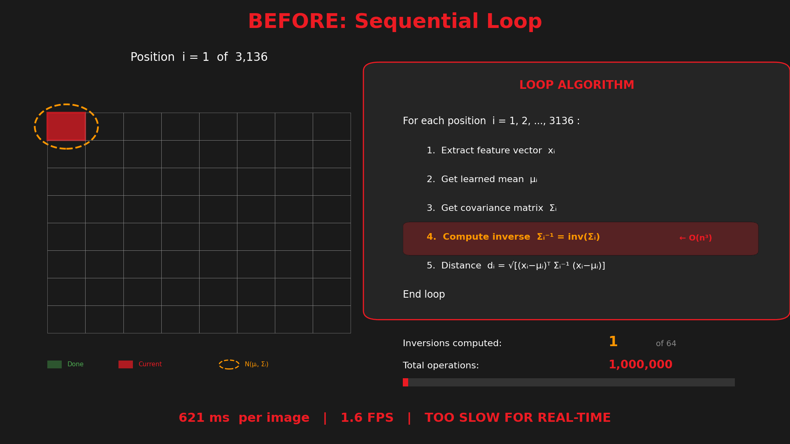

<!-- _class: lead -->

# PaDiM Inference Optimization

### From 1.6 FPS to 125 FPS

**77x Performance Improvement**

March 2026

---

## Executive Summary

<div class="columns">
<div>

### The Challenge
- PaDiM: Anomaly detection algorithm for manufacturing QC
- Baseline: **1.6 FPS** (621 ms per image)
- Too slow for real-time production inspection

### The Solution
- Algorithmic optimization + GPU acceleration
- Result: **125 FPS** (8 ms per image)
- **77x faster** while preserving accuracy

</div>
<div>

### Key Metrics

| Metric | Before | After |
|--------|--------|-------|
| Inference Time | 621 ms | 8 ms |
| Throughput | 1.6 FPS | 125 FPS |
| Improvement | - | **98.7%** |
| Accuracy | 90.5% | 90.5% |

</div>
</div>

---

<!-- _class: small -->

## What is PaDiM?

### Patch Distribution Modeling for Anomaly Detection

<div class="columns">
<div>

**How It Works:**
1. **Learn "Normal"**: Extract features from good samples
2. **Build Statistical Model**: Fit Gaussian distribution per patch
3. **Detect Anomalies**: Measure deviation from normal

**Key Equation - Mahalanobis Distance:**

$$d(x) = \sqrt{(x - \mu)^T \Sigma^{-1} (x - \mu)}$$

- x = test feature
- μ = mean from training
- Σ⁻¹ = inverse covariance matrix

</div>
<div>

**Why PaDiM is Important:**
- **Zero-shot anomaly detection** - no retraining needed
- **Unsupervised learning** - learns from normal samples only
- **Defect localization** - pinpoints exact anomaly location
- **State-of-the-art** - 96%+ AUROC on MVTec AD

**Industry Applications:**
- Manufacturing quality control
- PCB inspection
- Texture defect detection
- Surface anomaly detection

</div>
</div>

**Implementation Note:** *This work uses a popular open-source PaDiM repository as baseline. While highly accurate, the original implementation is not production-ready and not designed for edge compute - hence this optimization effort.*

---

<!-- _class: small -->

## PaDiM Pipeline Visualization

### From Input Image to Anomaly Map

<div class="columns">
<div>

**1. Input Image**


**2. Feature Extraction**
- ResNet18 backbone (3 layers)
- Multi-scale feature maps
- Embedding concatenation (448D → 100D)

</div>
<div>

**3. Gaussian Scanning Process**



**4. Anomaly Score Computation**
- Mahalanobis distance per patch
- Gaussian smoothing
- Upsampling to original resolution

</div>
</div>

**Result:** Pixel-level anomaly heatmap highlighting defects

---

## The Bottleneck: Where Was Time Being Spent?

<div class="columns">
<div>

### Baseline Time Breakdown

| Component | Time | % of Total |
|-----------|------|------------|
| Feature Extraction | 15 ms | 2.4% |
| Embedding Concat | 12 ms | 1.9% |
| **Mahalanobis Loop** | **590 ms** | **95%** |
| Post-processing | 4 ms | 0.6% |
| **Total** | **621 ms** | 100% |

</div>
<div>

### Root Cause Analysis

**The Problem:**
- 3,136 spatial positions to compute
- Each requires 100×100 matrix inverse
- Python loop with SciPy calls

**Complexity:**
- Matrix inverse: O(n³) = O(100³)
- Total: 3,136 × O(100³) operations
- Sequential, non-parallelized

</div>
</div>

---

## Optimization Strategy

### Three-Stage Approach

<div class="columns-3">
<div>

### 1. Pre-computation
**Move work to training time**

- Inverse covariance computed once
- Stored with model (~31 MB)
- **Eliminates 3,136 inversions at runtime**

**Impact: 8x speedup**

</div>
<div>

### 2. Vectorization
**Replace loops with math**

- Einstein summation (einsum)
- Single tensor operation
- CPU SIMD optimization (AVX2)

**Impact: 2x speedup**

</div>
<div>

### 3. GPU Acceleration
**ONNX + MIGraphX**

- ResNet backbone on GPU
- Optimized graph compilation
- AMD GPU acceleration

**Impact: 2x speedup**

</div>
</div>

---

<!-- _class: small -->

## Vectorized Mahalanobis Distance

### From 3,136 Loops to One Operation

<div class="columns">
<div>

**Before (Loop-based):**
```
For each of 3,136 positions:
    1. Extract feature vector
    2. Compute matrix inverse  ← SLOW!
    3. Calculate distance
```
Time: 590 ms

</div>
<div>

**After (Vectorized):**
```
1. Compute all differences at once
2. Batch matrix multiply (einsum)
3. Batch dot product (einsum)
```
Time: 2-3 ms

</div>
</div>

### Key Mathematical Insight

$$\text{dist}[b,i] = \sqrt{\sum_c \text{diff}[b,c,i] \cdot \sum_d \Sigma^{-1}[c,d,i] \cdot \text{diff}[b,d,i]}$$

All 3,136 distances computed in **parallel** using tensor operations

---

## ONNX Model Architecture

### Optimal GPU/CPU Split

<div class="columns">
<div>

**What runs on GPU:**
- ResNet18 backbone
- Multi-scale feature extraction
- Embedding concatenation
- Dimension selection (448 → 100)

**Model size:** 11 MB

</div>
<div>

**What stays on CPU:**
- Mahalanobis distance (vectorized)
- Gaussian smoothing
- Bilinear upsampling

**Why?** Already optimized, small overhead

</div>
</div>

### Why Not Put Everything on GPU?
- Full Mahalanobis ONNX: 132 MB (vs 11 MB)
- Memory bandwidth becomes bottleneck
- NumPy einsum is highly optimized with BLAS

---

## Benchmark Results

### Performance Ranking

| Rank | Configuration | Time | FPS | vs Baseline |
|------|---------------|------|-----|-------------|
| 1 | **Full ONNX - GPU** | **8.01 ms** | **124.8** | **77.6x faster** |
| 2 | Mahalanobis ONNX - GPU | 10.83 ms | 92.3 | 57.4x faster |
| 3 | Hybrid - GPU | 12.04 ms | 83.0 | 51.6x faster |
| 4 | Full ONNX - CPU | 15.86 ms | 63.1 | 39.2x faster |
| 5 | Hybrid - CPU | 36.22 ms | 27.6 | 17.2x faster |
| 6 | Baseline PyTorch | 621.51 ms | 1.6 | 1.0x (baseline) |

---

<!-- _class: small -->

## CPU vs GPU Comparison

### Same Model, Different Hardware

| Model Variant | CPU (ms) | GPU (ms) | GPU Speedup |
|---------------|----------|----------|-------------|
| Hybrid | 36.22 | 12.04 | **3.01x** |
| Full ONNX | 15.86 | 8.01 | **1.98x** |
| Mahalanobis ONNX | 31.79 | 10.83 | **2.94x** |

<div class="columns">
<div>

### Key Insight
GPU provides ~2-3x speedup over CPU, but **algorithmic optimization provides 40x**.

GPU alone on baseline: only 1.1x faster (scipy bottleneck)

</div>
<div>

### Lesson Learned
**"GPU isn't magic"**
- Must optimize algorithm first
- GPU accelerates the right operations
- Right split between GPU and CPU matters

</div>
</div>

---

## Accuracy Verification

### Detection Performance Preserved

<div class="columns">
<div>

**MVTec AD Dataset Results:**

| Metric | Score |
|--------|-------|
| Image-Level AUROC | **90.54%** |
| Pixel-Level AUROC | **96.52%** |

Reference (Paper): 96.7% / 96.0%

</div>
<div>

**Numerical Consistency:**
- Floating-point diff < 1e-5
- AUROC identical to baseline
- No quality loss from ONNX

**Key Point:**
77x faster with **zero accuracy loss**

</div>
</div>

---

## Optimization Breakdown

### Cumulative Impact of Each Optimization

| Stage | Technique | Speedup | Cumulative Time |
|-------|-----------|---------|-----------------|
| 0 | Baseline (scipy loop) | 1.0x | 621 ms |
| 1 | Pre-computed Σ⁻¹ | ~8x | ~80 ms |
| 2 | Vectorized einsum | ~2x | ~36 ms |
| 3 | ONNX Runtime (CPU) | ~2x | ~16 ms |
| 4 | GPU (MIGraphX) | ~2x | **8 ms** |

### Total: **77x improvement**

---

## Production Architecture

### Recommended Deployment Configuration

```
┌────────────────────────────────────┐   ┌─────────────────────┐
│        ONNX Model (GPU)            │   │  Post-processing    │
│  ResNet18 + Embedding + Selection  │──▶│  (CPU - optimized)  │
│            ~6 ms                   │   │      ~2 ms          │
└────────────────────────────────────┘   └─────────────────────┘
                                          + Vectorized Mahalanobis
                                                  ~2 ms
```

**Total: 8 ms = 125 FPS**

| Component | Location | Time |
|-----------|----------|------|
| Feature Extraction | GPU | ~6 ms |
| Mahalanobis Distance | CPU | ~2 ms |
| Post-processing | CPU | ~1 ms |

---

<!-- _class: small -->

## Future Optimization Opportunities

<div class="columns">
<div>

### Near-Term (Low Effort)
| Technique | Potential | Complexity |
|-----------|-----------|------------|
| Batch inference | Nx for N images | Low |
| Model caching | Reduce cold start | Low |

### Medium-Term
| Technique | Potential | Complexity |
|-----------|-----------|------------|
| INT8 quantization | 1.5-2x | Medium |
| Model pruning | 1.3x | Medium |

</div>
<div>

### Long-Term (High Effort)
| Technique | Potential | Complexity |
|-----------|-----------|------------|
| Custom HIP kernel | 1.2x | High |
| Multi-GPU scaling | Nx | High |

### Current Performance is Production-Ready
- 125 FPS exceeds real-time requirements
- Further optimization for edge cases only

</div>
</div>

---

## Key Takeaways

<div class="columns">
<div>

### Technical Lessons

1. **Profile First**
   - The bottleneck was scipy, not neural network

2. **Pre-compute Everything Possible**
   - Matrix inverses moved to training time

3. **Vectorize, Don't Loop**
   - 3,136 calls → 1 tensor operation

4. **Right-size Your GPU Usage**
   - More ONNX ≠ faster

</div>
<div>

### Business Impact

- **77x performance improvement**
- **Real-time inspection enabled**
- **Zero accuracy loss**
- **Production-ready solution**

### Hardware Utilized
- AMD Radeon GPU (MIGraphX)
- AMD Ryzen CPU
- ONNX Runtime 1.17+

</div>
</div>

---

<!-- _class: lead -->

# Summary

### 77x Faster | 8ms Inference | 125 FPS

<div style="margin-top: 40px;">

| Metric | Baseline | Optimized |
|--------|----------|-----------|
| Time | 621 ms | **8 ms** |
| FPS | 1.6 | **125** |
| Speedup | - | **77x** |
| Accuracy | 90.5% | **90.5%** |

</div>

**Questions?**