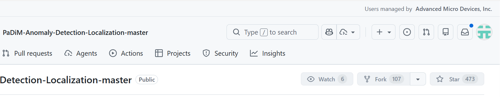
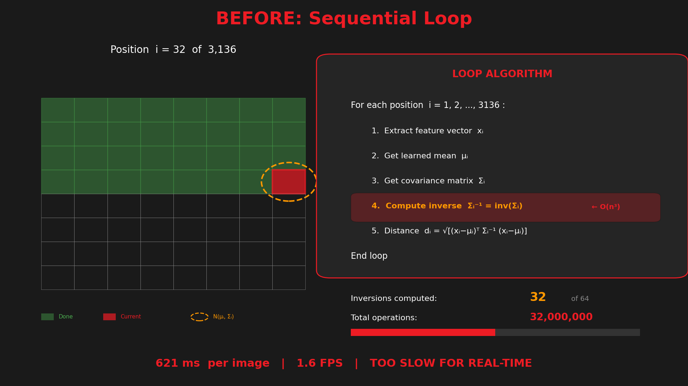
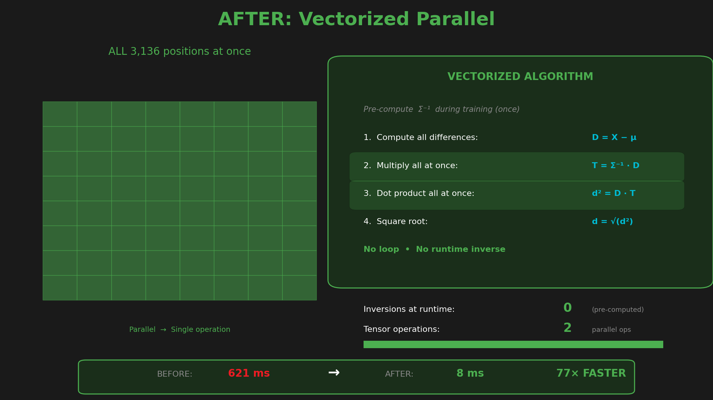

<!-- _class: lead -->

# PaDiM Model Optimization

### From Research Code to Production-Ready Inference

**77x Performance Improvement**

March 2026

---

<!-- _class: small -->

## What is PaDiM & Why Does It Matter?

### Patch Distribution Modeling for Anomaly Detection

<div class="columns">
<div>

**How It Works:**
1. **Learn "Normal"**: Extract features from +ve examples using CNN backbone
2. **Build Statistical Model**: Fit Gaussian distribution per patch location
3. **Detect Anomalies**: Measure deviation using Mahalanobis distance

**Why PaDiM is Important:**
- Zero-shot anomaly detection: - no -ve samples needed
- Defect localization: - pinpoints exact anomaly location
- State-of-the-art: - 96%+ AUROC on MVTec AD benchmark

</div>
<div>

**The Challenge:**
- Implementation taken from a popular open-source repository
- **Not production-ready** out of the box
- **Not designed for edge compute**
- Sequential processing, heavy Python overhead



**Industry Applications:**
- Manufacturing quality control
- PCB inspection
- Surface anomaly detection

</div>
</div>

---

<!-- _class: tiny -->

## PaDiM Pipeline: Gaussian Scanning Process

<div class="columns-wide">
<div>



</div>
<div class="code-large">

*Each patch compared against learned Gaussian distribution*

**Pipeline Steps:**
1. Feature Extraction (ResNet18)
2. Embedding Concat (448D)
3. Dimension Reduction (→100D)
4. Gaussian Scan - Compare each patch to learned distribution
5. Anomaly Map - Mahalanobis distance per spatial location

**The Bottleneck:**
- 3,136 spatial positions
- Each needs distance computation
- Python loop with SciPy calls

</div>
</div>

---

<!-- _class: small -->

## Key Optimization Insight

### Inverse Covariance Can Be Pre-computed

<div class="columns">
<div>

**Original Approach (Per-Inference):**
```
For each of 3,136 positions:
    1. Get covariance matrix Σ
    2. Compute inverse Σ⁻¹  ← SLOW!
    3. Calculate Mahalanobis distance
```

**Problem:** Computing Σ⁻¹ is O(n³) = O(100³)

**Solution:**
- Σ⁻¹ is **constant** after training
- Compute once, save to disk (~31 MB)
- Load and reuse during inference

**Impact:** Eliminates 3,136 matrix inversions at runtime

</div>
<div>

**Optimized Pipeline:**

With `inv_cov` and `mean` pre-computed and loaded:

```python
# Pre-loaded from training
mean = load("mean.pkl")        # [100, 56, 56]
inv_cov = load("inv_cov.pkl")  # [100, 100, 56, 56]

# Inference - no matrix inverse needed!
diff = embedding - mean
dist = mahalanobis(diff, inv_cov)
```

**Result:** The expensive operations are moved to training time. Rest of the loop can be **parallelized** and **converted to ONNX**.

</div>
</div>

---

<!-- _class: tiny -->

## Vectorized Mahalanobis Distance

<div class="columns-wide">
<div>



</div>
<div class="code-large">

**Implementation (Einstein Summation):**
```python
left = np.einsum('ci,cdij->di', diff, inv_cov)
dist = np.sqrt(np.einsum('di,di->i', diff, left))
```
- **Mahalanobis:** $d(x) = \sqrt{(x - \mu)^T \Sigma^{-1} (x - \mu)}$
- **Vectorized:** $\text{dist}[i] = \sqrt{\sum_{c,d} \text{diff}[c,i] \cdot \Sigma^{-1}[c,d,i] \cdot \text{diff}[d,i]}$
- **Key Insight:** 
  - No Python loops
  - BLAS/LAPACK optimized, CPU SIMD (AVX2)
  - **ONNX convertible**
  - All 3,136 distances in ONE op
</div>
</div>


---

## Performance Results

### Speed Gains from Baseline to Full ONNX GPU

| Configuration | Time (ms) | FPS | vs Baseline |
|---------------|-----------|-----|-------------|
| Baseline PyTorch (scipy loop) | 621.51 | 1.6 | 1.0x |
| Pre-computed Σ⁻¹ | ~80 | ~12 | ~8x |
| + Vectorized einsum (CPU) | 36.22 | 27.6 | 17.2x |
| + ONNX Runtime (CPU) | 15.86 | 63.1 | 39.2x |
| **+ GPU (MIGraphX)** | **8.01** | **124.8** | **77.6x** |

<div class="highlight-box">

**Key Achievement:** From 621 ms to 8 ms — **77x speedup** with zero accuracy loss

</div>

---

<!-- _class: small -->

## Future Optimization Opportunities

### What Could Be Done Next

<div class="columns">
<div>

**NPU Acceleration:**
- Running CNN backbone on **NPU** could improve performance
- AMD XDNA / Intel NPU support via ONNX Runtime
- Offload ResNet18 feature extraction
- Free up GPU for other tasks

**Mahalanobis Distance Optimization:**
- Explore more optimal versions of `Mahalanobis Distance` compatible for **NPU/GPU**
- Custom kernels for einsum operations
- Fused operations to reduce memory bandwidth

</div>
<div>

**Other Opportunities:**

| Technique | Potential | Complexity |
|-----------|-----------|------------|
| NPU backbone | 1.5-2x | Medium |
| INT8 quantization | 1.5-2x | Medium |
| Batch inference | Nx for N images | Low |
| Custom HIP kernel | 1.2x | High |

**Current Status:**
- 125 FPS already exceeds real-time requirements
- Further optimization for edge deployment scenarios

</div>
</div>

---

<!-- _class: lead -->

# Summary

### 77x Faster | 8ms Inference | 125 FPS

<div style="margin-top: 40px;">

| Metric | Baseline | Optimized |
|--------|----------|-----------|
| Time | 621 ms | **8 ms** |
| FPS | 1.6 | **125** |
| Speedup | - | **77x** |
| Accuracy | 90.5% | **90.5%** |

</div>

**Key Takeaways:**
- Pre-compute inverse covariance at training time
- Vectorize with einsum for parallel computation
- ONNX + GPU acceleration for production deployment

**Questions?**
