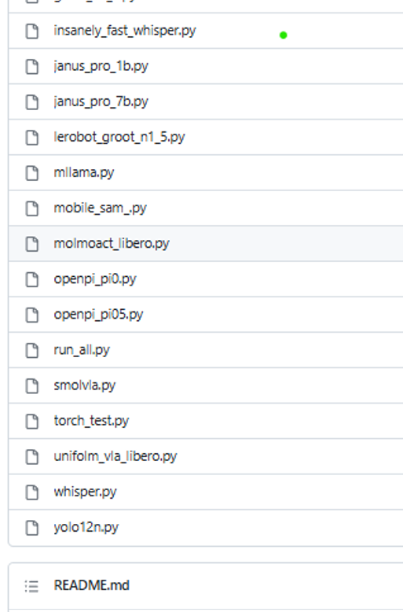
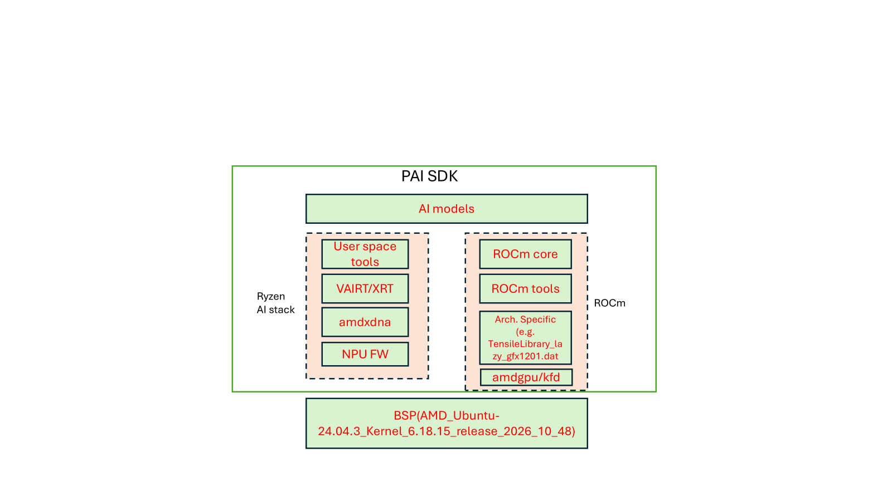

<!-- _class: lead -->

# Physical AI SDK

## The Low-Resistance Path to AMD Silicon

**One Interface · Every Language · CPU · GPU · NPU**

---

<!-- _class: compact -->

## What is Physical AI SDK?

- **Physical AI SDK (PAI SDK)** is a **unified inference engine** that catalyses your product development on AMD hardware.

- It does this by creating a **"Low-Resistance Path"** to AMD silicon.

- A single **unified interface** to run AI workloads across **CPU, GPU, and NPU** on AMD edge hardware.

<div class="highlight-box">

**Learn one interface — deploy across every AMD compute device**, from edge CPU to iGPU to NPU.

</div>

---

<!-- _class: tiny -->

## Physical AI SDK — The Pitch

<div style="font-size:0.95em; color:#00bcd4; font-style:italic; margin-top:-0.4em; margin-bottom:0.5em;">From Camera to Product — in 4 NMTS</div>

<div class="columns">
<div>

<div style="display:flex; flex-direction:column; align-items:center; gap:0;">
  <div style="display:flex; align-items:center; justify-content:center; gap:10px;">
    <div style="width:90px;"></div>
    <div style="background:#2a2a2a; border:1px solid #4caf50; border-radius:5px; padding:6px 16px; text-align:center; color:#ffffff; width:190px;"><strong style="color:#4caf50;">App · logic / UI</strong><br><span style="font-size:0.85em; color:#cccccc;">decisions · action</span></div>
    <div style="width:90px; color:#3498db; font-weight:bold; font-size:0.82em; line-height:1.15;">2 NMTS<br>postprocess</div>
  </div>
  <div style="display:flex; flex-direction:column; align-items:center; margin:3px 0;">
    <div style="width:0; height:0; border-left:9px solid transparent; border-right:9px solid transparent; border-bottom:13px solid #3498db;"></div>
    <div style="width:4px; height:16px; background:#3498db;"></div>
  </div>
  <div style="display:flex; align-items:center; justify-content:center; gap:10px;">
    <div style="width:90px;"></div>
    <div style="background:#3498db; border-radius:5px; padding:8px 18px; text-align:center; color:#ffffff; width:190px;"><strong style="color:#ffffff;">Physical AI SDK</strong><br><span style="font-size:0.85em;">Inference Engine</span></div>
    <div style="width:90px; color:#4caf50; font-weight:bold; font-size:0.82em; line-height:1.15;">0 NMTS<br>you write none</div>
  </div>
  <div style="display:flex; flex-direction:column; align-items:center; margin:3px 0;">
    <div style="width:0; height:0; border-left:9px solid transparent; border-right:9px solid transparent; border-bottom:13px solid #3498db;"></div>
    <div style="width:4px; height:16px; background:#3498db;"></div>
  </div>
  <div style="display:flex; align-items:center; justify-content:center; gap:10px;">
    <div style="width:90px;"></div>
    <div style="background:#2a2a2a; border:1px solid #666; border-radius:5px; padding:6px 16px; text-align:center; color:#ffffff; width:190px;"><strong style="color:#00bcd4;">Camera / Sensor</strong><br><span style="font-size:0.85em; color:#cccccc;">raw frames</span></div>
    <div style="width:90px; color:#3498db; font-weight:bold; font-size:0.82em; line-height:1.15;">2 NMTS<br>preprocess</div>
  </div>
</div>

- **2 NMTS in** — capture, hand to the SDK
- **0 NMTS middle** — the SDK *is* the engine
- **2 NMTS out** — act on the results

<span class="success">Total effort: 4 NMTS → a working edge app</span>

</div>
<div>

<div style="font-size:0.82em; color:#ffffff; margin-bottom:5px;"><strong style="color:#3498db;">NMTS</strong> = "Not More Than Ten (lines of code)" — one unit of developer effort.</div>

**The whole application — in Python**

<pre style="background:#f6f8fa; color:#24292e; font-family:'Courier New',monospace; font-size:0.62em; padding:9px 11px; border-radius:5px; line-height:1.4; white-space:pre; margin:0;"><span style="color:#6a737d;"># NMTS 1 · set up the SDK</span>
<span style="color:#d73a49;">from</span> physical_ai_sdk.inference_engine <span style="color:#d73a49;">import</span> <span style="color:#6f42c1;">InferenceEngine</span>
engine = <span style="color:#6f42c1;">InferenceEngine</span>(<span style="color:#032f62;">"physical-ai-sdk.local"</span>)
yolo   = engine.model(<span style="color:#032f62;">"yolov12"</span>)
<span style="color:#6a737d;"># NMTS 2 · read the camera</span>
frame = Camera.open(<span style="color:#005cc5;">0</span>).read()
<span style="color:#6a737d;"># NMTS 3 · inference — SDK does everything</span>
dets = yolo.predict(frame)
<span style="color:#6a737d;"># NMTS 4 · act on the results</span>
<span style="color:#d73a49;">for</span> d <span style="color:#d73a49;">in</span> dets:
    <span style="color:#6f42c1;">draw_box</span>(frame, d.box, d.label)</pre>

<div style="margin-top:6px; font-size:0.72em; color:#cccccc;">Same call, every language: <span style="display:inline-block; background:#2a2a2a; border:1px solid #3498db; color:#00bcd4; border-radius:10px; padding:1px 8px; margin:0 1px; font-weight:bold;">Python</span> <span style="display:inline-block; background:#2a2a2a; border:1px solid #3498db; color:#00bcd4; border-radius:10px; padding:1px 8px; margin:0 1px; font-weight:bold;">C++</span> <span style="display:inline-block; background:#2a2a2a; border:1px solid #3498db; color:#00bcd4; border-radius:10px; padding:1px 8px; margin:0 1px; font-weight:bold;">Kotlin</span> <span style="display:inline-block; background:#2a2a2a; border:1px solid #3498db; color:#00bcd4; border-radius:10px; padding:1px 8px; margin:0 1px; font-weight:bold;">JS</span></div>

<div style="border:2px solid #3498db; border-radius:6px; padding:7px; background:#202020; margin-top:6px;">
  <div style="text-align:center; font-weight:bold; color:#ffffff; margin-bottom:4px; font-size:0.88em;">Physical AI SDK</div>
  <div style="background:#3498db; color:#ffffff; text-align:center; font-weight:bold; border-radius:4px; padding:3px 0; margin-bottom:5px; font-size:0.76em;">Inference Engine · one interface, seamless access</div>
  <div style="display:flex; gap:4px; margin-bottom:5px;">
    <div style="flex:1; background:#2a2a2a; border:1px solid #666; border-radius:4px; padding:4px 1px; text-align:center; font-size:0.66em;"><strong style="color:#00bcd4;">YOLOv12</strong><br>detect</div>
    <div style="flex:1; background:#2a2a2a; border:1px solid #666; border-radius:4px; padding:4px 1px; text-align:center; font-size:0.66em;"><strong style="color:#00bcd4;">MobileNetV3</strong><br>classify</div>
    <div style="flex:1; background:#2a2a2a; border:1px solid #666; border-radius:4px; padding:4px 1px; text-align:center; font-size:0.66em;"><strong style="color:#00bcd4;">MobileSAM</strong><br>segment</div>
    <div style="flex:1; background:#2a2a2a; border:1px solid #666; border-radius:4px; padding:4px 1px; text-align:center; font-size:0.66em;"><strong style="color:#00bcd4;">Llama-3</strong><br>LLM</div>
  </div>
  <div style="text-align:center; color:#4caf50; font-size:0.66em; font-weight:bold; margin:3px 0;">one call runs seamlessly on any AMD compute</div>
  <div style="display:flex; gap:4px;">
    <div style="flex:1; background:#333333; border:1px solid #4caf50; border-radius:4px; padding:3px 1px; text-align:center; font-size:0.66em; color:#ffffff;"><strong style="color:#4caf50;">AMD CPU</strong></div>
    <div style="flex:1; background:#333333; border:1px solid #4caf50; border-radius:4px; padding:3px 1px; text-align:center; font-size:0.66em; color:#ffffff;"><strong style="color:#4caf50;">AMD GPU</strong></div>
    <div style="flex:1; background:#333333; border:1px solid #4caf50; border-radius:4px; padding:3px 1px; text-align:center; font-size:0.66em; color:#ffffff;"><strong style="color:#4caf50;">AMD NPU</strong></div>
  </div>
</div>

</div>
</div>

<div style="display:flex; align-items:stretch; gap:10px; margin-top:22px;">
  <div style="flex:1; background:#2a2a2a; border-left:4px solid #e05555; border-radius:5px; padding:7px 12px; font-size:0.85em;"><strong style="color:#ff8a8a;">Without PAI SDK</strong> — Triton + ROCm + gRPC setup, per-language rewrites, <strong style="color:#ff8a8a;">weeks</strong> to first inference</div>
  <div style="display:flex; align-items:center;"><div style="width:0; height:0; border-top:11px solid transparent; border-bottom:11px solid transparent; border-left:18px solid #3498db;"></div></div>
  <div style="flex:1; background:#2a2a2a; border-left:4px solid #4caf50; border-radius:5px; padding:7px 12px; font-size:0.85em;"><strong style="color:#4caf50;">With PAI SDK</strong> — one call, <strong style="color:#4caf50;">4 NMTS</strong>, 2 engineers, <strong style="color:#4caf50;">half a week</strong> to a stable app on AMD</div>
</div>

<div class="highlight-box" style="margin-top:12px; text-align:center;">
<span style="font-size:1.5em; font-weight:bold; color:#4caf50;"><span style="color:#ffffff;">The Pitch:</span> Physical AI SDK accelerates AI development on AMD Edge-HW — <span style="color:#4aa3ff;">from a quarter to a week</span></span>
</div>

---

<!-- _class: small -->

## Same Inference Call — Every Language

<div class="columns">
<div>

**Python**

```python
from physical_ai_sdk.inference_engine \
    import InferenceEngine
engine = InferenceEngine(
    endpoint="physical-ai-sdk.local")
yolo = engine.model("yolov12")
dets = yolo.predict(frame)
```

**C++**

```cpp
#include <physical_ai_sdk/inference_engine.hpp>
auto engine = InferenceEngine(
    "physical-ai-sdk.local");
auto yolo = engine.model("yolov12");
auto dets = yolo.predict(frame);
```

</div>
<div>

**Android (Kotlin)**

```kotlin
import com.amd.physical_ai_sdk.InferenceEngine
val engine = InferenceEngine(
    endpoint = "physical-ai-sdk.local")
val yolo = engine.model("yolov12")
val dets = yolo.predict(frame)
```

**JavaScript / TypeScript**

```javascript
import { InferenceEngine }
    from "@amd/physical-ai-sdk";
const engine = new InferenceEngine({
  endpoint: "http://physical-ai-sdk.local:8000" });
const yolo = await engine.model("yolov12");
const dets = await yolo.predict(frame);
```

</div>
</div>

<div class="highlight-box">

**One mental model, four ecosystems.** Same `Detection {label, score, box}` output everywhere.

</div>

---

<!-- _class: smallest -->

## What Am I Getting in This SDK?

<div class="columns">
<div>

<div style="color:#00bcd4; font-weight:bold; font-size:1.08em; margin-bottom:2px;">The Engine</div>

- **Unified inference engine** — one interface across **CPU · GPU · NPU**, every language (Python · C++ · Android · JS) and transport (in-place · gRPC · HTTP), **zero-copy on edge**

<div style="color:#00bcd4; font-weight:bold; font-size:1.08em; margin:8px 0 2px;">The Models</div>

- **Optimized model zoo** — AMD-tuned models per task
- **Add a model = drop a config**; parallel · sequential · batched pipelines, all by config

</div>
<div>

<div style="color:#00bcd4; font-weight:bold; font-size:1.08em; margin-bottom:2px;">The performance</div>

- **Accuracy, throughput & PnP benchmarks** on edge for every model

<div style="color:#00bcd4; font-weight:bold; font-size:1.08em; margin:8px 0 2px;">The Delivery</div>

- **OOB & Docker** — reproducible, ready-to-ship packaging

- **Co-engineering** with lighthouse customers — cut latency, tune accuracy

</div>
</div>

<div class="highlight-box">

A **low-resistance path** to a **co-engineered, benchmarked, containerized** product on AMD edge hardware.

</div>

---

<!-- _class: smallest -->

## Pipelines & Models — Config, Not Code

<div class="columns">
<div>

**Parallel — describe the topology**

```yaml
# pipelines/detect_classify.yaml
name: detect_classify
parallel:
  - model: yolov12       # run
  - model: mobilenetv3   # side by side
```

```python
out = engine.model(
    "detect_classify").predict(frame)
out.detections      # from YOLOv12
out.classification  # from MobileNetV3
```

*Concurrent — no threads, no GIL, no locks.*

</div>
<div>

**Sequential — chain the steps**

```yaml
# pipelines/detect_stream.yaml
name: detect_stream
sequential:
  - model: preprocess  # raw → tensor
  - model: yolov12     # tensor → dets
```

**Add a model — drop a config**

```yaml
# models/my_detector/config.yaml
name: my_detector
task: detect      # auto pre + NMS post
weights: my_detector.onnx
```

</div>
</div>

<div class="highlight-box">

**Parallel · sequential · batched · load-shared** — all a config choice. New models appear on every transport and language automatically.

</div>

---

<!-- _class: smallest -->

## Physical AI SDK - Structure & Workflow

### Three Paths — Pick the One That Fits Your Workflow

<div class="columns-3">
<div>

**Option 1: Zero Steps**

Every example ships with a pre-generated `METRICS_TABLE.md`

```
examples/yolov12/METRICS_TABLE.md
```

- CPU, GPU, NPU throughput & latency
- Cross-device comparison table
- Auto-generated from benchmark runs
- **Plan:** expose as a web dashboard

<div class="highlight-box">

<span class="success">Just open the file — numbers are already there</span>

</div>

</div>
<div>

**Option 2: Docker (One Command)**

Pre-installed ROCm + RyzenAI environment

```bash
# Pull & run the container
docker run physical-ai-sdk

# Inside the container:
make benchmark-all-devices metrics
```

- No local installs needed
- Reproducible environment
- Generates `METRICS_TABLE.md` automatically

<div class="highlight-box">

<span class="success">One command to fresh numbers</span>

</div>

</div>
<div>

**Option 3: Manual Setup**

Full local installation — 4 steps:

```bash
# 1. Install ROCm and raizen-ai
./install.sh

# 2. Navigate to example
cd examples/yolov12

# 3. Run benchmarks
make benchmark-all-devices metrics
```

Output: `METRICS_TABLE.md`

<div class="highlight-box">

<span class="warning">Most control, most setup</span>

</div>

</div>
</div>

---

<!-- _class: small -->

## Easy to Use

### Uniform Interface Across Every Example

<div class="columns">
<div>

**Make-Based Uniformity**

Same commands work in **every** example directory:

```bash
make benchmark-all-devices metric   # all devices
make benchmark-gpu                  # GPU only
make benchmark-cpu                  # CPU only
make benchmark-npu                  # NPU only
make eval                           # evaluation pipeline
```

- Learn once, use everywhere
- No per-model setup surprises
- Consistent output format (`METRICS_TABLE.md`)

</div>
<div>

**Every Example Includes:**

| Feature | Description |
|---------|-------------|
| **CPU / GPU / NPU flows** | Benchmark each compute device for throughput & latency |
| **Eval pipeline** | Sample inputs → sample outputs to visually verify correctness |
| **Guiding documentation** | Per-example tutorial to walk you from setup to results |

<div class="highlight-box">

**Principle:** If you can run one example, you can run them all — same commands, same structure, same outputs.

</div>

</div>
</div>

---

<!-- _class: lead -->

# Relation with AIG & Value Add

### How PAI SDK builds on — and feeds back into — the AMD AI ecosystem

---

<!-- _class: smallest -->

## Contributions — Research Desk → Vertical Software

### 1. PAVS transforms raw researcher code into production-ready vertical software

<div class="columns-3">
<div>

**What we receive: Research Repo**



*Flat list of scripts — no structure, no device flows, no Make targets*

</div>
<div>

**What we receive: Research Code**

```python
# rocm-scripts/test/pytorch/yolo12n.py
#........
# .......
# .......
#........
# .......
# .......
recalled = gt_labels & detected_classes
recall = len(recalled) / len(gt_labels)
sanity_pass = recall >= RECALL_THRESHOLD
assert sanity_pass, (
  f"recall {recall:.0%} < {RECALL_THRESHOLD:.0%}")

return lats, {
  "architecture": "CNN",
  "task": "object_detection",
  "num_detections": num_detections,
  "recall": round(recall, 4),
}
if __name__ == "__main__":
  sys.exit(run(run_benchmark))
```

*Single script, no structure, no device flows*

</div>
<div>

**What we deliver: Vertical Software**

```
examples/yolov12/
├── Makefile
├── METRICS_TABLE.md
├── README.md
├── app/
│   ├── routes/
│   ├── services/
│   ├── main.py & config.py
├── scripts/
│   ├── benchmark.py
│   ├── export_onnx.py
│   ├── profile_model.py
│   ├── run_val.py
│   └── update_metrics_table.py
├── tests/
│   ├── test_api.py
│   ├── test_docker.py
│   ├── test_migraphx.py
│   └── test_yolo_workflow.py
├── weights/
├── datasets/
├── requirements.txt
├── requirements_cpu.txt
└── requirements_npu.txt
```

*App, scripts, tests, per-device requirements — production-ready*

</div>
</div>

<div class="highlight-box">

**Physical AI & Vertical Software:** Researcher's Desk → Vertical Software — same commands, every device, production-ready.

</div>

---

<!-- _class: smallest -->

## Contributions(contd.) — Building the AMD AI Ecosystem

<div class="columns">
<div>

**2. AIG vs PAVS — Functional Correctness over Operator Validation**

| | **AIG** | **PAVS** |
|---|---------|----------|
| **Approach** | Operator validation | Functional correctness |
| **Inputs** | Dummy / synthetic tensors | Real input datasets |
| **Measures** | Throughput on isolated ops | End-to-end accuracy + throughput + latency |
| **Pipeline** | Op-level checks | Full inference pipeline (pre → infer → post) |

<div class="highlight-box">

PAVS implements the **end-to-end working pipeline** and ensures the model produces **expected outputs from real input datasets** — not just numbers from dummy inputs.

</div>

</div>
<div>

**3. Developer-Friendly Inference Tools & LLM Infra**

Profilers + LLM serving stacks — with tutorials for ease of adoption:

| Category | Tools |
|----------|-------|
| **Profilers** | Lemonade, NPU AI Analyzer, ROCProfiler |
| **LLM Infra** | vLLM (high-throughput serving), Llama.cpp (edge inference), FastFlowLM (LLMs on NPU) |

Bridging the **open-source ecosystem** ↔ **AMD HW ecosystem** — making these tools easy to use across the AMD stack.

**4. Vertical Application Platform**

A platform that **evolves with the client** — solving, fixing, and growing together in targeted domains:

| Domain | Focus |
|--------|-------|
| **Healthcare** | Medical imaging, diagnostics |
| **Automotive** | Perception, safety systems |
| **Industrial** | Inspection, anomaly detection |


</div>
</div>

---

<!-- _class: smallest -->

## Contributions(contd.) — AIG Model → Task-Specific

### 5. Operationalizing AIG Models for Real Applications

<div class="columns">
<div>

**From Generic to Task-Specific**

Took generic AIG Hub models and extended them with operation enablement, hyperparameter tuning, and backend exploration to reach application-level performance:

| Backend | Role |
|---------|------|
| **PyTorch** | Fallback path — handles missing/broken operators |
| **torch.compile** | Additional optimization on top of PyTorch |
| **ONNX** | Stable cross-device flow (CPU ↔ GPU ↔ NPU) |
| **MIGraphX** | **2× improvement** over torch+ROCm |

<div class="highlight-box">

**MobileSAM · CenterPoint · YOLOv12 · YOLO26** — integrated into AARTS robotics pipelines, consumed by the robotics team today.

</div>

</div>
<div>

**SmolVLA: Tuned for the Task**

| | **AIG Generic** | **PAVS Task-Specific** |
|---|---|---|
| **Latency** | 48 ms | **30 ms** |
| **ROCm version** | — | **7.2.4** |
| **Customized to task** | ✗ | ✓ |

**37% latency reduction through algorithmic tuning alone** — on ROCm 7.2.4, without the edge-optimized kernels in ROCm 7.13 that give **2× speedup** on other models.

The gains here are purely from **task-specific model and algorithm optimization** — not from a newer ROCm stack.

<div class="highlight-box">

**Headroom remains:** upgrading to ROCm 7.13 on top of these algorithmic gains is expected to push latency even lower.

</div>

</div>
</div>

---

<!-- _class: small -->

## Contributions(contd.) — Ecosystem & Co-Engineering

### 6. Closing the Loop: Generic Model → Application Pipeline

<div class="columns">
<div>

**The Full Journey**

Continuing from the previous point — we don't stop at model operationalization:

1. Pick generic model from AIG Hub
2. Make it **task-specific** (tune, operationalize)
3. **Compute accuracy** on real inputs — surface gaps
4. **Communicate gaps back to AIG** for model improvement
5. Wire model into **inference pipelines** — connecting to real applications

<div class="highlight-box">

Taking the generic model all the way to working applications — not just benchmarks.

</div>

</div>
<div>

**Co-Engineering Opportunities**

**PAVS × Audio SDK**
- Started discussions to explore co-engineering across SDK verticals
- Shared infrastructure, tooling, and pipeline patterns

**Rivian (RVT) — Automotive Stack**
- Using PAI SDK models to build an **in-car monitoring system** and **voice assistant** on AMD hardware

**Google — Gemma on LiteRT**
- Running the **Gemma** model on **LiteRT** on AMD hardware

</div>
</div>

---

<!-- _class: smallest -->

## Contributions(contd.) — Feedback Loop Back to AIG

### Gaps Found, Communicated, and Tracked

<div class="columns">
<div>

**Performance & Deprecation Risks**

- **MIGraphX + ONNX is 2× faster than torch.compile** — communicated to AIG and cautioned against deprecating MIGraphX until hipDNN reaches equivalent performance

- **Concat layer broken in YOLOv26** — layer not decomposing correctly, producing garbage outputs; Jiras opened to track and get AIG attention

- **MIGraphX breaks MobileSAM** — missing operator causing failures; AIG informed to investigate the unsupported op

</div>
<div>

**Operator Gaps & Tooling**

- **ScatterND not available** in MIGraphX EP or ONNX EP — communicated to AIG for prioritization~(centerpoint)

- **NPU debug tools received** — now able to analyze layer-level outputs that are not producing correct results and provide richer, more precise feedback to AIG

- **Unified NPU + GPU dependency request** — GPU stack requires NumPy <2, NPU stack requires NumPy 2+; the version conflict forces separate virtual environments today. Communicated to AIG to resolve this so NPU and GPU can share a single application-level environment

</div>
</div>

<div class="highlight-box">

**PAVS acts as the functional correctness signal for AIG** — we find what breaks on real inputs and real pipelines, and feed that back so the stack improves.

</div>

---

<!-- _class: small -->

## Contributions(contd.) — PAI SDK Platform & Edge Enablement

### Infrastructure: Installer, Edge HW, and LLM Stack

<div class="columns">
<div>

**Installation & Edge Hardware**

- **Single installer/uninstaller** for ROCm + RyzenAI in PAI SDK — one command to set up or tear down the full stack
- Extended and maintained ROCm + RAI support for **edge HW** — required targeted patches for hardware-specific gaps
- **Yocto & LTS support** — enabling model deployment on embedded edge devices

</div>
<div>

**LLM Infrastructure on AMD Stack**

- Integrated **stable vLLM** — high-throughput serving with quantized LLM variants on iGPU
- Integrating **FLM framework** — running LLMs on NPU
- Bridging the open-source LLM ecosystem onto the AMD edge stack

<div class="highlight-box">

Full-stack edge enablement: installer → hardware patches → quantized LLM serving → NPU inference → Yocto deployment.

</div>

</div>
</div>

---

<!-- _class: small -->

## Pain Points & Solution

### Current Challenges on Edge Devices — and How We've Addressed Them

<div class="columns">
<div>

**Challenges**

**ROCm Installation Stability**
- ROCm install on edge devices is **not yet stable**
- Driver/firmware mismatches on some hardware revisions

**Reboot During Installation**
- ROCm installation requires a **system reboot** mid-process
- Breaks unattended / CI-driven installs

**Sudo / Root Access Required**
- Both ROCm and RyzenAI installers need **sudo privileges**

</div>
<div>

**Solution: Dockerized PAI SDK**

We have **dockerized the full setup** — ROCm + RyzenAI pre-installed, pre-configured, and ready to use out of the box:

```bash
# Pull and run — no installs, no reboot, no sudo
docker run physical-ai-sdk

# Start benchmarking immediately
make benchmark-all-devices metrics
```

- No local ROCm install required
- No reboot, no sudo on host
- Reproducible environment across machines
- **Ready to deliver to users today**

</div>
</div>

<div class="highlight-box">

**Docker sidesteps all three pain points** — users get the full PAI SDK on the fly, without touching the host system.

</div>

---

<!-- _class: lead -->

# SW Stack (For Reference)

