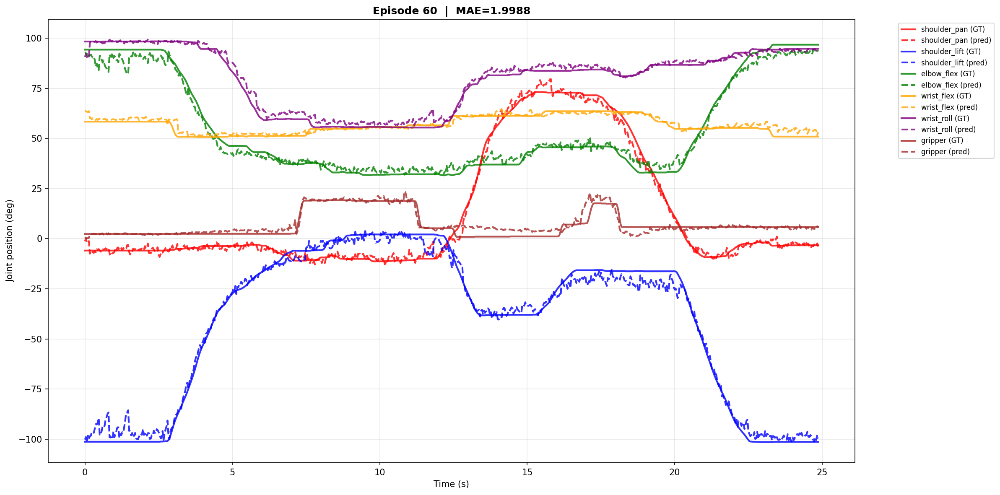
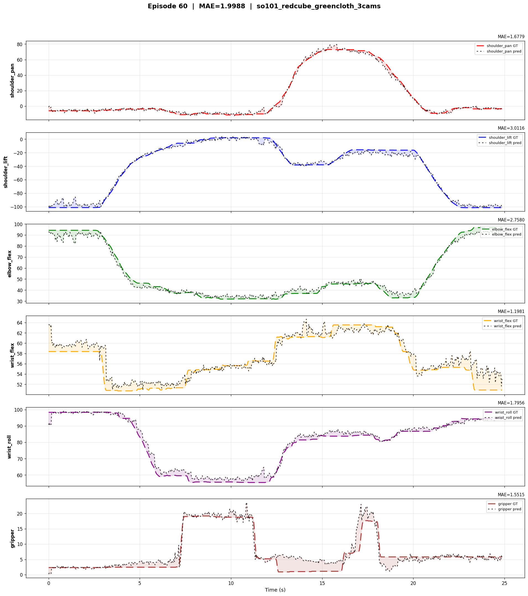

<!-- _class: smallest -->

## Joint Trajectories — GT vs Predicted

### Episode 60 | SO-101 Red Cube Green Cloth (3 Cams) | MAE = 1.9988

**All Joints — Overlay**

All 6 joints (shoulder, elbow, wrist, gripper) plotted together — solid = GT, dashed = predicted

**Per-Joint Breakdown**

Individual MAE per joint — shoulder_pan: 1.68, shoulder_lift: 3.01, elbow_flex: 2.76, wrist_flex: 1.20, wrist_roll: 1.80, gripper: 1.55

Predicted trajectories closely track ground truth across all joints — largest error on shoulder_lift (MAE 3.01), tightest on wrist_flex (MAE 1.20)

---

<!-- _class: smallest -->

## Training Progress — Policy Improvement Over Time

### SO-101 Task Execution: April 28 → May 2, 2026

<video src="./vedios/28_04_2026.mp4" width="440" controls></video>

<strong>April 28</strong> — Baseline

<video src="./vedios/29_04_2026.mp4" width="440" controls></video>

<strong>April 29</strong> — Day 2

<video src="./vedios/30_04_2026.mp4" width="440" controls></video>

<strong>April 30</strong> — Day 3

<video src="./vedios/02_05_2026.mp4" width="440" controls></video>

<strong>May 2</strong> — Latest

Progressive improvement visible across iterations — from initial baseline (Apr 28) to refined policy execution (May 2)

