# Knowledge Flow Graph — Robotics & Physical AI
*Topic slug: robotics-ecosystem | Mode: checkpoint | Cap: 3 new iterations (iter 2–4), + Iteration 5 resumed round (2026-09-06) | Initialized: 2026-08-11 | Resumed: 2026-08-13, 2026-09-06*
*Seed reports: embedded-robotics-market-analysis.md · physical-ai-robotics-market-analysis.md · robotics-ecosystem-market-analysis.md · edge-inference-ecosystem-for-robotics-market-analysis.md (added 2026-08-13) · l1-l2-hardware-simtoreal-amd-gap-analysis.md · physical-ai-robotics-inference-pipeline-commercial-layers-market-analysis.md (added 2026-09-06)*

---

## Block A — Flow Diagram

```mermaid
graph TD
  N1["N1: Seed — Value migrating up-stack; hardware commoditizing"]
  N2["N2: Seed — China controls ~65% of physical components"]
  N3["N3: Seed — Warp/Newton/cuRobo = CUDA lock-in; LeRobot/MJX = ROCm-ready"]
  N4["N4: Seed — NVIDIA moat is ~80% ecosystem, ~20% hardware"]
  N5["N5: Seed — Data is binding constraint: 1M episodes vs LLM trillions"]
  N6["N6: Seed — AMD FPGA 125µs control loop = hidden differentiator"]
  N7["N7: Seed — Tactile sensing = largest open platform opportunity"]
  N8["N8: Seed — ROCm momentum: 37% to 93% in vLLM in 2 months"]
  N9["N9: Q — Which upper-stack layer most defensible for non-NVIDIA?"]
  N10["N10: Q — Western actuator whitespace AMD ecosystem could anchor?"]
  N11["N11: Q — How many devs blocked from AMD by the Warp gap?"]
  N12["N12: Q — What would AMD-compatible synthetic data factory require?"]
  N13["N13: Q — Which open data infra investments most accelerate AMD entry?"]
  N14["N14: Q — What abstracts AMD FPGA advantage into dev-friendly SDK?"]
  N15["N15: Q — Who's winning tactile sensing? Hardware-agnostic AMD play?"]
  N16["N16: Q — Which ROCm packages unlock most robotics developer adoption?"]
  N17["N17: Finding — AMD has KRS+REP 2008+Xen but no callable FPGA control API"]
  N18["N18: GAP-AMD — No ROS 2/Python API for AMD FPGA 125µs loop"]
  N19["N19: Q — Pre-baked bitstream + ROS 2 hardware_interface plugin for Kria?"]
  N20["N20: Q — ROBOTCORE Zynq layer OEM'd by AMD as first-party FPGA SDK?"]
  N21["N21: Finding — LeRobot gateway best entry; working code but no model cards in hub"]
  N22["N22: GAP-AMD — No AMD model card in LeRobot hub; devs default to GR00T"]
  N23["N23: Q — AMD SmolVLA checkpoint in LeRobot hub shifts developer defaults?"]
  N24["N24: Q — Which CUDA ops block official Cosmos 3 ROCm guide?"]
  N25["N25: Q — First-mover window: Cosmos 3 ROCm before NVIDIA's integration?"]
  N26["N26: Finding — Genesis Quadrants is ROCm-native; Cosmos 3 Nano runs on AMD"]
  N27["N27: GAP-AMD — No end-to-end validated AMD synthetic data pipeline"]
  N28["N28: Q — MI300X throughput ceiling for Genesis+Cosmos Nano pipeline?"]
  N29["N29: Q — AMD partnership with Genesis AI for integrated data factory?"]
  N1 --> N9
  N2 --> N10
  N3 --> N11
  N4 --> N12
  N5 --> N13
  N6 --> N14
  N7 --> N15
  N8 --> N16
  N14 --> N17
  N17 --> N18
  N18 --> N19
  N17 --> N20
  N9 --> N21
  N21 --> N22
  N22 --> N23
  N21 --> N24
  N21 --> N25
  N12 --> N26
  N26 --> N27
  N27 --> N28
  N27 --> N29
  N30["N30: Seed — Multi-format inference chaos: 5–7 artifacts per model"]
  N31["N31: Seed — VLA inference stuck 6–15 Hz; manipulation needs 20–100 Hz"]
  N32["N32: Seed — ROCm Linux-only excludes Windows industrial robot segment"]
  N33["N33: Seed — Fleet deployment infrastructure barely exists as a product"]
  N34["N34: Seed — MARL fails above 80 agents; sub-10ms at 200+ is unsolved"]
  N36["N36: Q — Vendor-neutral C++ robotics inference SDK (TensorRT-equivalent)?"]
  N37["N37: Q — Hardware-agnostic 50+ Hz fast-path policy runtime on AMD?"]
  N38["N38: Q — AMD Windows ROCm/DirectML path + excluded market size?"]
  N39["N39: Q — AMD as compute anchor for physical AI edge data center / fleet?"]
  N40["N40: Q — MI300X HBM3 enabling MARL architectures past 100 agents?"]
  N30 --> N36
  N31 --> N37
  N32 --> N38
  N33 --> N39
  N34 --> N40
  N41["N41: Finding — Warp 7K stars; Newton 5.1K adopted by BD/Agility/Figure/Toyota; no ROCm commitment"]
  N42["N42: GAP-AMD — No Warp ROCm backend; Linux Foundation path available; 2M devs CUDA-locked"]
  N43["N43: Finding — AMD engaged Genesis (ROCm tutorial + arXiv 2026); Genesis not in Partner Network"]
  N44["N44: GAP-AMD — Genesis absent from AMD Robotics Partner Network; free enrollment closes gap"]
  N45["N45: Finding — ROCm 7.2.2 (CES 2026) unified Windows+Linux; AMD still has zero IPC certified wins"]
  N46["N46: GAP-AMD — $6.1B Windows IPC accessible now; gap is vendor certification, not software"]
  N47["N47: Finding — ModulEdge exclusively NVIDIA; GPU-agnostic container; OTA market $1.4B→$5.85B"]
  N48["N48: GAP-AMD — Robot fleet edge data center; ModulEdge GPU-agnostic; AMD MI300X path exists"]
  N49["N49: Finding — MI300X ~50–80% of H100 for Cosmos; NATTEN 2.6x locked to Hopper/Blackwell"]
  N50["N50: Q — AMD as Linux Foundation Newton member contributing ROCm Warp backend?"]
  N51["N51: Q — Genesis Robotics Partner Network enrollment before NVIDIA claims Genesis?"]
  N52["N52: Q — Which IPC vendors (Beckhoff/Advantech/ADLINK) for AMD X100 Windows ML cert?"]
  N53["N53: Q — MI300X + ROCm vLLM qualifying inside ModulEdge GPU-agnostic containers?"]
  N54["N54: Q — Wan2.2 (AMD MLPerf 6.0) as drop-in for Cosmos Predict2 in AMD data pipeline?"]
  N11 --> N41
  N41 --> N42
  N42 --> N50
  N29 --> N43
  N43 --> N44
  N44 --> N51
  N38 --> N45
  N45 --> N46
  N46 --> N52
  N39 --> N47
  N47 --> N48
  N48 --> N53
  N28 --> N49
  N49 --> N54
  N55["N55: Finding — Newton Apache-2.0 LF; MJWarp not differentiable on any backend; AMD=co-architect path"]
  N56["N56: Finding — Eno silicon chosen now; no NVIDIA-Genesis link; guide > enrollment as commercial signal"]
  N57["N57: Finding — AMD CPU wins (CX20x3, K4131-Px) but zero GPU/NPU wins in TwinCAT ML or SIMATIC Edge"]
  N58["N58: Finding — Comino already supports MI300X; ModulEdge blog lists AMD GPU servers; gap is GTM only"]
  N59["N59: Finding — MI355X 93–108% of B200 on Wan2.2 MLPerf; FlashAR+ CUDA-pinned; one-engineer ROCm port"]
  N60["N60: GAP-AMD — AMD as co-architect of differentiable Newton physics API (not Warp porter; LF member)"]
  N61["N61: GAP-AMD — Genesis Eno silicon decided now; joint 'Eno on AMD' guide is the commercial signal"]
  N62["N62: Pivot — ModulEdge gap is GTM-only; Robotics Partner Network engagement, not Comino OEM process"]
  N63["N63: Q — AMD approach DeepMind at researcher level for differentiable Newton physics co-authorship?"]
  N64["N64: Q — Min viable 'Eno on AMD' guide: Ryzen AI MAX + Real2Sim2Real + GENE-26.5 inference?"]
  N65["N65: Q — Co-announce AMD MI300X as supported GPU config in ModulEdge units alongside NVIDIA B200?"]
  N66["N66: Q — AMD Composable Kernel port of FlashAR anti-diagonal decoding to ROCm on CDNA3?"]
  N50 --> N55
  N55 --> N60
  N60 --> N63
  N51 --> N56
  N56 --> N61
  N61 --> N64
  N52 --> N57
  N53 --> N58
  N58 --> N62
  N62 --> N65
  N54 --> N59
  N59 --> N66
  N67["N67: Q — NVIDIA-proprietary edge inference SDKs (TensorRT/GXF/Isaac) with no open/AMD equivalent?"]
  N68["N68: Q — Open-source inference (ONNX RT/TVM/MLC-LLM): minimal AMD contribution to unlock self-porting?"]
  N69["N69: Q — MLC-LLM/Apache TVM on AMD Kria/Versal NPU — what backend is missing for edge robotics?"]
  N36 --> N67
  N16 --> N68
  N37 --> N69
  N70["N70: Finding — Isaac/GXF/TRT/cuVSLAM all CUDA-only; GXF NITROS = no open equivalent; 2M devs locked"]
  N71["N71: Finding — MLC-LLM ROCm wheels already ship; gap = one CI pipeline for LeRobot VLA on AMD gfx942"]
  N72["N72: Finding — MLC-LLM no Kria/Versal backend; Vitis AI DPU CNN-only; AIE needs MLIR-AIE (no TVM path)"]
  N73["N73: Finding — No vendor-neutral SDK: Kenning(ROS2,noVLA) + vla.cpp(VLA,noROS2) = near-misses each missing 2+ criteria"]
  N74["N74: Finding — Zero published Hz benchmark for VLA on AMD; AMD claims 10Hz unverified; NVIDIA 55+ Hz confirmed"]
  N75["N75: Pivot — AMD internally building ROCm-native NITROS equivalent comparable to Isaac ROS 4.0 on Jetson Thor; gap is GTM timing only"]
  N76["N76: GAP-AMD — No MLC-LLM CI pipeline for LeRobot VLA on AMD; one CI action = community self-porting flywheel"]
  N77["N77: GAP-AMD — AMD Kria/Versal: no open LLM inference compiler path; Vitis AI proprietary + CNN-only"]
  N78["N78: GAP-AMD — No vendor-neutral robotics inference SDK; AMD + vla.cpp + Kenning = closest assembler"]
  N79["N79: GAP-AMD — VLA Hz benchmark gap: AMD MI300X HBM3 action-expert advantage entirely unmeasured"]
  N80["N80: Q — Optimal timing + framing for AMD to announce NITROS-equivalent alongside or ahead of Isaac ROS 4.0 Jetson Thor launch?"]
  N81["N81: Q — AMD ROCm EP to vla.cpp + Kenning VLA support → amd-robotics-inference meta-SDK?"]
  N82["N82: Q — Ryzen AI NPU AIE-ML via Windows ML/ONNX Runtime VOE: path to MLC-LLM embedded robotics?"]
  N83["N83: Q — ACT/SmolVLA Hz benchmark on Ryzen AI MAX+ 395 FastFlowLM vs PyTorch+ROCm?"]
  N67 --> N70
  N68 --> N71
  N69 --> N72
  N36 --> N73
  N37 --> N74
  N70 --> N75
  N71 --> N76
  N72 --> N77
  N73 --> N78
  N74 --> N79
  N75 --> N80
  N76 --> N81
  N78 --> N81
  N77 --> N82
  N79 --> N83
  N84["N84: Seed — l1-l2-hardware-simtoreal-amd-gap-analysis.md: 6 core gaps (Warp/cuRobo/IsaacSim/ONNXEP/edgeSDK/MJXvisibility) + L0 safety/RTOS expansion + L3 VLA edge expansion"]
  N85["N85: Seed — physical-ai-inference-pipeline-commercial-layers.md: 5-layer stack (observability/safety-cert/data-flywheel/MLOps-lifecycle/sim-to-real), MLOps lifecycle flagged 'no vendor owns this layer today'"]
  N86["N86: GAP-AMD — No AMD path into GPU-accelerated motion planning; cuRobo is CUDA-only, no ROCm analog shipped"]
  N87["N87: GAP-AMD — No AMD equivalent to Isaac Sim as an integrated authoring+physics+rendering platform"]
  N88["N88: GAP-AMD — ONNX Runtime ROCm EP deprecated; AMD inference path fragmented across MIGraphX/DirectML/Vitis AI"]
  N89["N89: GAP-AMD — AMD edge hardware (X100/Kria) ships with no validated, benchmarked robotics SDK stack"]
  N90["N90: GAP-AMD — No AMD GPU benchmark visibility in sim-to-real literature; MJX/Warp docs cite only NVIDIA numbers"]
  N91["N91: GAP-AMD — No certified safety envelope (IEC 61508/ISO 26262) for AMD AI-inference compute; certs cover FPGA fabric only"]
  N92["N92: GAP-AMD — No AMD equivalent to NVIDIA Halos AI Systems Inspection Lab / full-stack safety program"]
  N93["N93: GAP-AMD — ISO 25785 humanoid safety standard still draft-stage; no confirmed AMD participation in TC 299"]
  N94["N94: GAP-AMD — NVIDIA GR00T fine-tuning workflow locked to NVIDIA hardware; no AMD-documented equivalent path"]
  N95["N95: GAP-AMD — Isaac Teleop data-collection integration in LeRobot excludes AMD hardware targets"]
  N96["N96: GAP-AMD — VLA training cluster market emerging; AMD MI300X capacity unclaimed vs NVIDIA DGX/HGX defaults"]
  N97["N97: GAP-AMD — No robot inference observability layer tracks Hz/latency/VLA-drift; zero RocProfiler integration anywhere"]
  N98["N98: GAP-AMD — No commercial data-intelligence/fleet-curation layer for continuous learning; AMD compute unclaimed"]
  N99["N99: GAP-AMD — No integrated VLA-specific safety-gated MLOps/lifecycle platform exists for any vendor — highest-conviction whitespace"]
  N84 --> N86
  N84 --> N87
  N84 --> N88
  N84 --> N89
  N84 --> N90
  N84 --> N91
  N84 --> N92
  N84 --> N93
  N84 --> N94
  N84 --> N95
  N84 --> N96
  N85 --> N97
  N85 --> N98
  N85 --> N99
  N85 --> N91
  N100["N100: Finding — rocRobo (embryonic ROCm cuRobo analog) exists; AMD-authored PRs #1770/#1865 upstream HIP/ROCm groundwork into NVIDIA/warp — inflection point, not zero-effort"]
  N101["N101: Finding — All 5 prior top actions confirmed still open (Sept 2026); AMD's own AI DevMaster Hackathon spawned lerobot#4205 requesting ROCm CI matrix; Digital Twin Consortium joined AMD Robotics Partner Network"]
  N102["N102: Finding — No RocProfiler/ROCm telemetry integration in any robotics observability platform or in ros-opentelemetry (ROSCon 2025); AMD Partner Network has zero observability partners"]
  N103["N103: Finding — No integrated VLA lifecycle platform exists (registry+A/B+rollback+drift) for any vendor; Ketryx (safety QMS) is closest counter-candidate but pre-deployment only"]
  N104["N104: Finding — AMD has TÜV SÜD-certified Versal/Zynq design-flow (IEC 61508+ISO 26262) covering FPGA fabric only, plus active QNX and Green Hills RTOS partnerships — but zero certified AI-inference-tile safety path"]
  N105["N105: Pivot — GAP-1/N42 (Warp ROCm backend) upgraded: 'no community effort' → 'early-stage upstream-in-progress' given rocRobo + AMD's own Warp PRs #1770/#1865"]
  N100 --> N105
  N42 --> N105
  N100 --> N86
  N101 --> N76
  N102 --> N97
  N103 --> N99
  N104 --> N91
  N104 --> N92
  N104 --> N93
```



---

## Block B — Numbered Node Index

```
1.  N1   [Seed]    Value is migrating up-stack to software while hardware commoditizes
2.  N2   [Seed]    China controls ~65% of physical-component supply chain
3.  N3   [Seed]    Warp/Newton/cuRobo = hard CUDA lock-in; LeRobot/MJX = ROCm-ready
4.  N4   [Seed]    NVIDIA moat is ~80% ecosystem (sim/data/devs), ~20% hardware
5.  N5   [Seed]    Data is binding constraint: 1M open episodes vs LLM-scale trillions
6.  N6   [Seed]    AMD FPGA 125us control loop is a real differentiator hidden by learning curve
7.  N7   [Seed]    Tactile sensing is the largest open platform opportunity in humanoids
8.  N8   [Seed]    ROCm momentum accelerating: 37% to 93% vLLM test pass rate in 2 months
9.  N9   [Q]       Which upper-stack layer is most defensible for a non-NVIDIA entrant?            [score 10 — answered→N21]
10. N10  [Q]       Is there a Western actuator/roller-screw whitespace AMD ecosystem could anchor? [score 9 — open]
11. N11  [Q]       How many developers/projects are blocked from AMD purely by the Warp gap?       [score 11 — partial: agent error, re-dispatch iter 2]
12. N12  [Q]       What would a credible AMD-compatible synthetic data factory require?             [score 10 — answered→N26]
13. N13  [Q]       Which open data infra investments most accelerate AMD's robotics ecosystem entry?[score 9 — open]
14. N14  [Q]       What would abstract AMD's FPGA advantage behind a developer-friendly SDK?        [score 11 — answered→N17]
15. N15  [Q]       Who is winning the tactile sensing market? Is there a hardware-agnostic AMD play?[score 10 — open]
16. N16  [Q]       Which ROCm packages, if officially ported, would unlock most robotics adoption?  [score 9 — open]
17. N17  [Finding] AMD has SDK building blocks (KRS/REP 2008/Xen) but no callable FPGA control API  [from N14]
18. N18  [GAP-AMD] No ROS 2/Python callable API for AMD FPGA 125us loop — top differentiator inaccessible to SW devs
19. N19  [Q]       What would "pre-baked bitstream + ROS 2 hardware_interface plugin" packaging look like for AMD Kria?  [score 10]
20. N20  [Q]       Could ROBOTCORE's Zynq UltraScale+ ROS 2 layer be OEM'd by AMD as first-party FPGA SDK?  [score 10]
21. N21  [Finding] LeRobot/HuggingFace gateway is AMD's best entry point; Pi0+SmolVLA run on ROCm but no model cards in hub  [from N9]
22. N22  [GAP-AMD] No AMD-hosted model card in LeRobot hub — developers default to GR00T (NVIDIA) at the callsite
23. N23  [Q]       Could AMD contribute a SmolVLA checkpoint to LeRobot hub and shift developer defaults as ROCm did in vLLM?  [score 10]
24. N24  [Q]       Which CUDA-specific ops block an official Cosmos 3 ROCm guide — and how does the effort compare to vLLM?  [score 10]
25. N25  [Q]       Is there a first-mover window to publish Cosmos 3 ROCm guide before NVIDIA's official LeRobot integration?  [score 10]
26. N26  [Finding] Genesis World 1.0 Quadrants compiler is ROCm-native; Cosmos 3 Nano community-confirmed on AMD ROCm  [from N12]
27. N27  [GAP-AMD] No validated end-to-end AMD synthetic data pipeline (Genesis+Cosmos+LeRobot) — NVIDIA-free data factory is whitespace
28. N28  [Q]       What is the throughput ceiling (trajectories/hr) for Genesis+Cosmos Nano on single MI300X (192GB HBM3)?  [score 11]
29. N29  [Q]       Could AMD partner with or acquire Genesis AI (ROCm-native Quadrants compiler) for an integrated AMD data factory?  [score 12]
30. N30  [Seed]    Multi-format deployment chaos: 5–7 inference artifacts per model; no cross-platform robotics runtime
31. N31  [Seed]    VLA inference stuck 6–15 Hz on edge; manipulation needs 20–100 Hz; dual-system (S1 30–50 Hz + S2 1–2 Hz) emerging
32. N32  [Seed]    AMD ROCm is Linux-only; meaningful industrial robot segment runs Windows-based edge nodes — AMD is excluded
33. N33  [Seed]    Fleet deployment infra "barely exists as a product today"; 4–7 TB/hr per fleet, built custom 6–18 months each time
34. N34  [Seed]    MARL coordination fails above 80 agents; no technique achieves sub-10ms for 200+ agents — quantified gap
35. N36  [Q]       Could AMD build a vendor-neutral C++ robotics inference SDK (ROS2-native, VLA-aware, multi-backend)?  [score 12 — answered→N73]
36. N37  [Q]       What hardware-agnostic fast-path policy runtime closes the 20+ Hz VLA gap on AMD silicon?  [score 12 — answered→N74]
37. N38  [Q]       What is AMD's fastest path to Windows ROCm/DirectML, and how large is the excluded industrial robot market?  [score 11]
38. N39  [Q]       Could AMD anchor the emerging physical AI edge data center for fleet deployment (OTA updates, local data landing)?  [score 12]
39. N40  [Q]       Does MI300X HBM3 memory bandwidth enable MARL architectures that scale past 100 agents at sub-10ms?  [score 9]
40. N41  [Finding] Warp 7K GitHub stars; Newton 5.1K stars, adopted by Boston Dynamics/Agility/Figure/Toyota/Skild/Samsung; no ROCm issue/commitment exists  [from N11]
41. N42  [GAP-AMD] No entity committed to Warp ROCm backend; Linux Foundation Newton membership gives AMD principled first-mover path; affects 2M NVIDIA robotics devs
42. N43  [Finding] AMD already formally engaged Genesis: Feb 2026 ROCm blog tutorial + 2026 arXiv Real2Sim2Real pipeline confirmed; Genesis still absent from AMD Robotics Partner Network  [from N29]
43. N44  [GAP-AMD] Genesis absent from AMD Robotics Partner Network despite confirmed technical relationship; free enrollment = immediate formalization before NVIDIA claims Genesis
44. N45  [Finding] AMD ROCm 7.2.2 (CES 2026) ships as unified Windows+Linux release with native PyTorch — exclusion technically closed; AMD has zero certified design wins in $6.1B Windows IPC market  [from N38]
45. N46  [GAP-AMD] $6.1B Windows industrial IPC market now technically accessible via ROCm 7.2.2+DirectML; gap is commercial certification on Beckhoff/Siemens/Advantech/ADLINK hardware lists
46. N47  [Finding] ModulEdge robot fleet edge data centers use exclusively NVIDIA GPUs; GPU-agnostic container architecture means AMD MI300X could qualify; OTA market $1.42B→$5.85B  [from N39]
47. N48  [GAP-AMD] Robot fleet edge data center with AMD MI300X + ROCm-native vLLM + ATC Deploy OTA — no product exists; ModulEdge GPU-agnostic container = direct displacement path
48. N49  [Finding] MI300X estimated 50–80% of H100 throughput for Cosmos pipeline; Cosmos NATTEN 2.6x speedup is Hopper/Blackwell-only; AMD VSA (3.31x, MLPerf 6.0) potentially closeable  [from N28]
49. N50  [Q]       Could AMD contribute ROCm Warp backend as Linux Foundation Newton member + co-develop differentiable MJWarp-on-ROCm with Google DeepMind?  [score 12]
50. N51  [Q]       Is Genesis Robotics Partner Network enrollment (free, immediate) sufficient to lock AMD-Genesis alliance before NVIDIA announces a Genesis relationship?  [score 12]
51. N52  [Q]       Which IPC vendors (Beckhoff, Advantech, Kontron, ADLINK) require AMD certification for Windows ML, and does Ryzen AI X100 ship with validated DirectML at Q4 2026 GA?  [score 11]
52. N53  [Q]       Does ModulEdge's GPU-agnostic container architecture (ModulEdge builds enclosure; Comino supplies GPU) mean AMD MI300X + ROCm vLLM can directly displace NVIDIA H200/B200?  [score 11]
53. N54  [Q]       Is Wan2.2 (open, AMD-submitted to MLPerf 6.0; Xiaomi FlashAR+ 82x speedup) a viable drop-in for Cosmos Predict2 in the AMD synthetic data pipeline?  [score 10]
54. N55  [Finding] Newton Apache-2.0 (LF); MJWarp non-differentiable on any backend — AMD=co-architect, not Warp porter  [from N50]
55. N56  [Finding] Genesis Eno: LG CNS June 2026 deployment, silicon chosen now; no NVIDIA-Genesis link; guide > enrollment as signal  [from N51]
56. N57  [Finding] AMD CPU wins (CX20x3, K4131-Px) in TwinCAT ML / SIMATIC Edge; zero GPU/NPU certified wins in either platform  [from N52]
57. N58  [Finding] Comino already supports AMD MI300X; ModulEdge blog lists AMD GPU servers; gap is purely GTM — no OEM process needed  [from N53]
58. N59  [Finding] MI355X 93–108% of B200 on Wan2.2 (MLPerf 6.0); FlashAR+ CUDA-pinned but one-engineer ROCm port via CK  [from N54]
59. N60  [GAP-AMD] AMD as co-architect of differentiable Newton physics API — joint feature with DeepMind, not a Warp port  [from N55]
60. N61  [GAP-AMD] Genesis Eno silicon chosen now; joint "Eno on AMD" inference guide is the commercial signal  [from N56]
61. N62  [Pivot]   ModulEdge gap reframed: GTM-only (Comino already supports MI300X); upgrades N48 confidence to High  [from N58]
62. N63  [Q]       Could AMD approach Google DeepMind at researcher level to co-author differentiable MJWarp-on-ROCm?  [score 11 — deferred: BD/GTM action, not research]
63. N64  [Q]       What is the minimum viable "Eno on AMD" guide: Ryzen AI MAX + Real2Sim2Real + GENE-26.5 inference?  [score 11 — deferred: BD/GTM action, not research]
64. N65  [Q]       Could AMD co-announce MI300X as supported GPU config in ModulEdge units alongside NVIDIA B200?  [score 10 — deferred: BD/GTM action, not research]
65. N66  [Q]       Is AMD Composable Kernel port of FlashAR+ anti-diagonal decoding feasible for CDNA3 ROCm?  [score 10 — deferred: BD/GTM action, not research]
66. N67  [Q]       Which NVIDIA-proprietary robotics edge inference SDKs (TensorRT plugins, GXF, Isaac ROS GPU nodes, cuDNN ops) have no open/AMD equivalent and gate the largest developer populations?  [score 12 — answered→N70]
67. N68  [Q]       In open-source inference frameworks (ONNX Runtime, Apache TVM/MLC-LLM, ExecuTorch, llama.cpp), what minimal AMD contributions would enable community self-porting of robotics models without per-model AMD involvement?  [score 12 — answered→N71]
68. N69  [Q]       What is the current status of MLC-LLM/Apache TVM on AMD Kria KV260/KR260 or Versal NPU for edge robotics inference — does MLC's universal deployment extend to AMD embedded NPUs, and if not, what backend is missing?  [score 11 — answered→N72]
69. N70  [Finding] Isaac ROS+NITROS/GXF/TRT/cuVSLAM all CUDA-only; GXF/NITROS hardest wall (2M devs, 7K+ Jetson Orin customers; ABB/FANUC/KUKA/Agility/Figure/UR/YASKAWA)  [from N67]
70. N71  [Finding] MLC-LLM already ships ROCm nightly wheels + auto-detects AMD GPU targets; gap = one GitHub Actions CI pipeline for LeRobot VLA models on AMD gfx942/gfx1100  [from N68]
71. N72  [Finding] MLC-LLM has no Kria/Versal backend; Vitis AI DPU CNN-only (no transformer ops); Versal AIE requires MLIR-AIE toolchain with no TVM frontend  [from N69]
72. N73  [Finding] No vendor-neutral robotics inference SDK — Kenning (ROS2+INT8, no VLA) + vla.cpp (VLA+GGUF, no ROS2; 150ms) = near-misses each missing 2+ criteria  [from N36]
73. N74  [Finding] Zero published Hz benchmark for VLA on AMD; AMD claims ~10 Hz unverified; action expert is memory-bound — MI300X HBM3 vs Jetson LPDDR5 advantage entirely unmeasured  [from N37]
74. N75  [Pivot]   AMD internally building ROCm-native NITROS equivalent comparable to Isaac ROS 4.0 on Jetson Thor; gap is GTM timing only, not technical  [from N70]
75. N76  [GAP-AMD] No MLC-LLM CI pipeline for LeRobot VLA model architectures on AMD gfx942/gfx1100; pre-compiled ROCm artifacts absent from mlc.ai/wheels — one CI action creates community self-porting  [from N71]
76. N77  [GAP-AMD] AMD Kria KV260/KR260 and Versal AIE NPU have no open LLM inference compiler path; Vitis AI proprietary + CNN-only; community self-porting flywheel for AMD embedded doesn't exist  [from N72]
77. N78  [GAP-AMD] No vendor-neutral robotics inference SDK combining ROS2 native + multi-silicon + INT4 + VLA — AMD + vla.cpp ROCm EP + Kenning VLA backend = closest assembler; structural uncontested gap  [from N73]
78. N79  [GAP-AMD] Zero VLA inference Hz benchmarks on AMD; MI300X HBM3 bandwidth advantage for memory-bound action expert is unquantified; commercial teams can't adopt AMD without this data  [from N74]
79. N80  [Q]       When/how should AMD announce its internal NITROS-equivalent to maximize competitive positioning vs. Isaac ROS 4.0 on Jetson Thor?  [post-cap — open]
80. N81  [Q]       Could AMD contribute ROCm EP to vla.cpp AND co-develop Kenning VLA model support AND package as amd-robotics-inference meta-SDK — analogous to vLLM ROCm?  [post-cap — open]
81. N82  [Q]       Is AMD Ryzen AI NPU (AIE-ML in Phoenix/Strix APUs) accessible via MLC-LLM through Windows ML / ONNX Runtime VOE — and does that architecture extend to Kria K24/K26 SOM AIE-ML tiles?  [post-cap — open]
82. N83  [Q]       What is the measured Hz for ACT-25M and SmolVLA-450M on Ryzen AI MAX+ 395 via FastFlowLM 1.0 vs. PyTorch+ROCm — and does XDNA2 NPU or RDNA3.5 iGPU win for the memory-bound action expert stage?  [post-cap — open]
83. N84  [Seed]    l1-l2-hardware-simtoreal-amd-gap-analysis.md ingested: 6 core gaps + L0 safety/RTOS expansion + L3 VLA edge expansion
84. N85  [Seed]    physical-ai-robotics-inference-pipeline-commercial-layers.md ingested: 5-layer stack, MLOps lifecycle = "no vendor owns this layer today"
85. N86  [GAP-AMD] No AMD path into GPU-accelerated motion planning (cuRobo CUDA-only)  [from N84]
86. N87  [GAP-AMD] No AMD equivalent to Isaac Sim as integrated sim platform  [from N84]
87. N88  [GAP-AMD] ONNX Runtime ROCm EP deprecated; AMD inference path fragmented  [from N84]
88. N89  [GAP-AMD] AMD edge hardware (X100/Kria) has no validated robotics SDK stack  [from N84]
89. N90  [GAP-AMD] No AMD GPU benchmark visibility in sim-to-real literature (MJX/Warp docs)  [from N84]
90. N91  [GAP-AMD] No certified safety envelope (IEC 61508/ISO 26262) for AMD AI-inference compute  [from N84/N85/N104]
91. N92  [GAP-AMD] No AMD equivalent to NVIDIA Halos AI Systems Inspection Lab  [from N84/N104]
92. N93  [GAP-AMD] ISO 25785 humanoid safety standard — draft stage, AMD participation unconfirmed  [from N84/N104]
93. N94  [GAP-AMD] GR00T fine-tuning workflow locked to NVIDIA hardware  [from N84]
94. N95  [GAP-AMD] Isaac Teleop data-collection integration in LeRobot excludes AMD  [from N84]
95. N96  [GAP-AMD] VLA training cluster market — AMD MI300X capacity unclaimed  [from N84]
96. N97  [GAP-AMD] No robot inference observability layer (Hz/latency/VLA-drift); zero RocProfiler integration anywhere  [from N85/N102]
97. N98  [GAP-AMD] No commercial data-intelligence/fleet-curation layer for continuous learning; AMD compute unclaimed  [from N85]
98. N99  [GAP-AMD] No integrated VLA-specific safety-gated MLOps/lifecycle platform for any vendor — highest-conviction whitespace  [from N85/N103]
99. N100 [Finding] rocRobo + AMD-authored PRs #1770/#1865 upstreaming HIP/ROCm into NVIDIA/warp — real inflection point, not zero effort  [motion-planning agent]
100. N101 [Finding] All 5 prior top actions still open Sept 2026; lerobot#4205 (AMD's own hackathon) requests ROCm CI matrix; Digital Twin Consortium joined AMD Robotics Partner Network  [status-check agent]
101. N102 [Finding] Zero RocProfiler/ROCm integration in any robotics observability platform or ros-opentelemetry; AMD Partner Network has zero observability partners  [observability agent]
102. N103 [Finding] No integrated VLA lifecycle platform exists for any vendor; Ketryx (safety QMS) is closest counter-candidate, pre-deployment only  [MLOps agent]
103. N104 [Finding] AMD TÜV SÜD-certified Versal/Zynq design-flow covers FPGA fabric only; active QNX + Green Hills RTOS partnerships; zero certified AI-inference-tile safety path  [safety-cert agent]
104. N105 [Pivot]   N42 (Warp ROCm backend) upgraded: "no community effort" → "early-stage upstream-in-progress" via rocRobo + AMD Warp PRs  [from N100]
```

---

## Block C — Node Detail Table

| ID | Type | From | Reasoning — *what led here + the direction I took* (2–3 sentences) | Driving question | AMD relevance | Status | Citations |
|----|------|------|----------------------------------------------------------------------|-----------------|---------------|--------|-----------|
| N1 | Seed | — | From robotics-ecosystem §"Market Overview": hardware costs are collapsing (Unitree humanoid $5,900 in 2025) while software CAGRs exceed 40–50%. I took the direction of asking which software layer AMD can *own* vs. follow, since owning one layer means collecting recurring value across all deployments — the strategic frame for every AMD upper-stack investment decision. | Which upper-stack layer is most defensible for non-NVIDIA? | H — frames where AMD should invest | answered→N9 | [R3] |
| N2 | Seed | — | From robotics-ecosystem §"Layer 2 — Actuation": China owns ~65% of components (harmonic drives, roller screws, NdFeB magnets); "America lost robotics at the actuator." I took the direction of asking whether reshoring creates a gap AMD's 30+ partner network could anchor, since the network is expandable to physical-layer suppliers as a value-add ecosystem play. | Is there a Western actuator whitespace AMD ecosystem could anchor? | M — adjacent via ecosystem | answered→N10 | [R3-L2] |
| N3 | Seed | — | From robotics-ecosystem §"Port List": Warp/Newton/cuRobo are Tier 2 hard CUDA lock-ins (warp-level primitives, PTX, JIT-to-CUDA that hipify cannot translate), while LeRobot/MJX/SmolVLA are already Tier 0 ROCm-ready. I took the direction of quantifying the *blocked developer population* — because the Warp port is the single highest-leverage action and its developer-count scale directly justifies AMD engineering investment. | How many devs blocked from AMD by the Warp gap? | H — sizes the ROI case for the #1 priority port | answered→N11 | [R3-PortList] |
| N4 | Seed | — | From robotics-ecosystem §"NVIDIA Default Status": NVIDIA's hardware moat is only ~20%; the other 80% is ecosystem (CUDA, Isaac, Cosmos, developer mindshare). I took the direction of asking what AMD-scale effort would replicate the synthetic data layer — because that layer is hardware-independent, open-sourceable, and is NVIDIA's stickiest moat. Competing here doesn't require beating Thor in TFLOPS. | What would AMD-compatible synthetic data factory require? | H — targets NVIDIA's HW-independent stickiest moat | answered→N12 | [R3-NVIDIA] |
| N5 | Seed | — | From physical-ai §"Gap 8 / Data wall": 1M open robot episodes vs. trillions of LLM tokens; "teleoperation = gold standard at $100/hr, <200 demos/worker/day." I took the direction of asking which open infrastructure investments give AMD the most ecosystem leverage — solving the universal data gap generates developer goodwill and embeds AMD hardware in the data collection stack before NVIDIA lock-in solidifies. | Which open data infra investments most accelerate AMD ecosystem entry? | H — data moat is the master gap | answered→N13 | [P1-Gap8] |
| N6 | Seed | — | From physical-ai §"Trends #6": Kria AI's 125 µs control loop (8,000 decisions/sec) + simultaneous VLA inference is technically superior to Jetson for real-time robotics, but "FPGA learning curve is the barrier — the play is abstracting it behind a high-level SDK." I took the direction of asking what that abstraction layer concretely looks like — because AMD's strongest differentiator is entirely invisible to its target developer audience. | What abstracts AMD FPGA advantage into a dev-friendly SDK? | H — converts AMD's top differentiator into adoption | answered→N14 | [P1-T6] |
| N7 | Seed | — | From robotics-ecosystem §"Gap 4 — Tactile": six-axis force/torque + tactile sensors are called "the largest open platform opportunity in humanoid robotics today," with no dominant horizontal supplier. I took the direction of asking who the current players are and whether AMD's open ecosystem positioning (ROCm + ROS 2 + open stack) could anchor a hardware-agnostic tactile-sensor platform across OEMs. | Who's winning tactile sensing? Hardware-agnostic AMD play? | M — gap AMD could anchor without new silicon | answered→N15 | [R3-L2] |
| N8 | Seed | — | From physical-ai §"ROCm status signal": ROCm went from 37% to 93% vLLM test-passing in 2 months (Nov 2025–Jan 2026), demonstrating real and fast AMD software velocity. I took the direction of asking which robotics packages would give the most developer adoption per unit of ROCm investment — since the same velocity applied to the right robotics repo could create a viral beachhead analogous to vLLM. | Which ROCm packages unlock most robotics developer adoption? | H — directs AMD's highest-ROI software investment | answered→N16 | [P1-ROCm] |
| N9 | Q | N1 | Follows N1: if value is migrating to software, rank upper-stack layers by NVIDIA lock-in depth vs. AMD entry feasibility — finding the layer where AMD's ROCm momentum gives the most traction. Candidates: simulation (PhysX/RTX lock), world models/data (open Cosmos), SDK middleware (cuVSLAM lock), foundation models, or developer gateway (LeRobot/HuggingFace). | (this node is the question) | H | answered→N21 | — |
| N10 | Q | N2 | Follows N2: China's 65% physical component dominance creates a reshoring gap that AMD's partner network could potentially anchor. Direction is to find whether Western actuator/roller-screw makers exist at scale and whether AMD-compatible hardware platforms could pair with an AMD-branded mechanical component program. | (this node is the question) | M | open | — |
| N11 | Q | N3 | Follows N3: the Warp gap is confirmed as the highest-leverage port but its developer impact is unquantified. GitHub stars, download counts, and enterprise adoptions of Warp/Newton/cuRobo would directly size the ROI case for AMD engineering resources on a ROCm Warp backend. | (this node is the question) | H | partial — agent error (AMD API auth); re-dispatch iter 2 with WebSearch | — |
| N12 | Q | N4 | Follows N4: NVIDIA's Cosmos (780K trajectories in 11 hours) is the stickiest hardware-independent moat. Direction is to find what open-source world models and simulation stacks would let AMD replicate this pipeline on MI300X — sizing the technical investment and cost/capability gap vs. NVIDIA. | (this node is the question) | H | answered→N26 | — |
| N13 | Q | N5 | Follows N5: the data gap is the master constraint for the entire industry. AMD contributing open data infrastructure (teleoperation rigs, synthetic pipelines, LeRobot-compatible datasets on HuggingFace) addresses the universal bottleneck while embedding AMD hardware in the data collection stack. Direction is to rank specific investments by ecosystem ROI. | (this node is the question) | H | open | — |
| N14 | Q | N6 | Follows N6: AMD's 125 µs FPGA control loop is technically superior but invisible to software developers. Direction is to find what a developer-friendly abstraction looks like (ROS 2 node wrapper? Python SDK? Pre-built Docker containers?) and whether analogous FPGA abstraction efforts — Qualcomm's QIRP SDK, NXP eIQ — provide a blueprint. | (this node is the question) | H | answered→N17 | — |
| N15 | Q | N7 | Follows N7: tactile sensing is the explicitly named largest open platform opportunity. Research should reveal current market leaders, whether any run on AMD-friendly hardware, and whether a cross-vendor sensor OS (analogous to ROS 2 for manipulation) could position AMD as the neutral platform host. | (this node is the question) | M | open | — |
| N16 | Q | N8 | Follows N8: AMD's ROCm software velocity is real and fast. Direction is to find whether there is a robotics equivalent of vLLM — a single high-traffic, high-impact open repo where AMD's contribution would immediately reach the largest developer population and create a viral beachhead for AMD hardware in robotics. | (this node is the question) | H | open | — |
| N17 | Finding | N14 | Agent found that AMD already has all the SDK building blocks — REP 2008 (`ament_hardware_acceleration`) provides a ratified ROS 2 standard for FPGA abstraction, Kria Robotics Stack (KRS) adds `colcon_acceleration`, and Xen hypervisor + RT isolation are pre-configured; but AMD's announced Robotics Core SDK (Q4 2026) is ROCm/NPU-centric and does NOT expose the FPGA control loop as a callable ROS 2 or Python API. I took the direction that the gap is not foundational — it's the last-mile packaging — and the blueprint (ROBOTCORE on Zynq UltraScale+: 2.5 µs deterministic ROS 2, zero HDL required) already exists as a licensable/fork-able component. | What specific packaging (bitstream + ROS 2 node) would close the gap? | H — the gap is smaller than expected; the fix is a packaging decision | answered→N18 | [14-1][14-4][14-7][14-9] |
| N18 | GAP-AMD | N17 | N17 revealed the gap is precision-targeted: all the substrate exists but the FPGA real-time control loop is not exposed as a callable API in AMD's shipping Robotics Core SDK. I flagged this as a GAP-AMD because it is the conversion mechanism between AMD's top hardware differentiator and developer adoption — and the ROBOTCORE precedent shows it can be closed in a single product release with an existing open-source codebase as foundation. | How quickly could AMD close this with ROBOTCORE OEM or fork? | H | open | [14-4][14-7] |
| N19 | Q | N18 | Follows N18: since the gap is "last-mile packaging," the sharpest next question is what the specific packaging model would look like — a pre-compiled bitstream (EtherCAT/CAN-FD/TSN) distributed as a ROS 2 APT package with a `hardware_interface` plugin, so developers `apt install kria-fpga-ros2` and never see an FPGA toolchain. This is directly analogous to how NVIDIA distributes TensorRT as a pip-installable inference backend. | (this node is the question) | H | open | — |
| N20 | Q | N17 | Follows N17: ROBOTCORE already exists as a shipping product on Zynq UltraScale+ with the exact behavior AMD needs. The direction is to find whether AMD could OEM, resell, or white-label ROBOTCORE under the AMD Kria SDK umbrella — avoiding the need to build from scratch and accelerating the timeline from "announced" to "shipping." | (this node is the question) | H | open | — |
| N21 | Finding | N9 | Agent found that the LeRobot/HuggingFace developer gateway is AMD's highest-feasibility entry point because (a) AMD already has confirmed working code — Pi0 fine-tuned on MI300X and deployed on Ryzen AI, SmolVLA on ROCm, Cosmos 3 Nano community-ported — (b) NVIDIA's grip at this layer is model-level (GR00T integration) not kernel-level, so displacement doesn't require forking infrastructure, and (c) PyTorch 2.7 now lists ROCm 6.3 as first-class. The specific gap is AMD's absence at the model hub level — no AMD-contributed or AMD-optimized checkpoint exists in the LeRobot model registry, so developers starting from the default LeRobot workflow always land on GR00T (NVIDIA) as the first recommendation. | What is the specific action that would make AMD visible at the LeRobot callsite? | H — the entry point is confirmed and AMD already has the artifacts to fill it | answered→N22 | [9-2][9-3][9-4][9-5][9-9] |
| N22 | GAP-AMD | N21 | N21 revealed the gap is callsite invisibility: AMD has working code on AMD hardware but has not published it to the HuggingFace model hub under the LeRobot namespace. NVIDIA's GR00T and Physical Intelligence's Pi0 are the visible defaults. I flagged this as a high-confidence GAP-AMD because the fix is an engineering action of known scope (commit a model card + ROCm reference config to lerobot hub), and the vLLM analogy (37%→93% in 2 months) shows AMD can move quickly once a specific target is named. | Could a single model card contribution trigger the same flywheel as vLLM? | H — smallest action with potentially largest developer-default impact | open | [9-2][9-5] |
| N23 | Q | N22 | Follows N22: the vLLM analogy is the key reference. AMD's ROCm CI pipeline was merged into vLLM in Dec 2025 and went from 37%→93% in 2 months — driven by a single focused effort. The question is whether contributing a SmolVLA checkpoint (already confirmed working on ROCm) to the LeRobot model hub with ROCm as the reference backend would trigger the same shift in developer default behavior for robotics. | (this node is the question) | H | open | — |
| N24 | Q | N21 | Follows N21: Cosmos 3 is open-source, PyTorch-based, and already community-confirmed on AMD ROCm. The question is what the delta is between "community hack" and "official AMD guide" — specifically which CUDA-specific ops (Flash Attention variants? Custom CUDA kernels in the diffusion sampler?) are the remaining blockers, and how that compares in scope to the vLLM porting effort AMD already completed. | (this node is the question) | H | open | — |
| N25 | Q | N21 | Follows N21: NVIDIA's Cosmos 3 integration into LeRobot is "planned soon" (not yet shipped as of research date). If AMD publishes an official "Cosmos 3 on ROCm" guide before NVIDIA's LeRobot integration ships, AMD could claim the synthetic-data-generation workflow on its hardware before NVIDIA makes it a single-click NVIDIA experience. This is a time-bounded opportunity. | (this node is the question) | H | open | — |
| N26 | Finding | N12 | Agent found that AMD's path to a Cosmos-equivalent synthetic data factory is technically viable today: Genesis World 1.0's Quadrants compiler natively targets AMD ROCm (`gs.init(backend=gs.amdgpu)`), AMD has published a ROCm blog confirming Genesis on MI-series GPUs, and Cosmos 3 Nano runs on AMD ROCm via community port. The critical missing piece is orchestration — no single validated pipeline strings together Genesis simulation + Cosmos photorealistic augmentation + trajectory export to LeRobot/Open-X format on AMD hardware. TCO parity is achievable (MI300X ~4% lower cost at 64-GPU scale) but FlashAttention-2 on MI300X is still 10–25% slower than CUDA at standard sequence lengths. | What is the minimum viable AMD synthetic data pipeline and its throughput ceiling? | H — technical path confirmed; the gap is orchestration and first-party ownership | answered→N27 | [12-3][12-4][12-6][12-10][12-11] |
| N27 | GAP-AMD | N26 | N26 confirmed the stack exists but is unorchestrated. Nobody has validated the Genesis + Cosmos Nano + LeRobot pipeline end-to-end on AMD hardware, and AMD has no first-party engineering ownership of this workflow. I flagged this as a GAP-AMD because the absence is strategic: the team that validates and publishes this pipeline first claims the "NVIDIA-free data factory" narrative — and with Genesis's ROCm-native Quadrants compiler, AMD has the clearest technical path. | Could AMD publish the end-to-end pipeline before any other party? | H — first-mover gap in the most strategically important layer | open | [12-3][12-4] |
| N28 | Q | N27 | Follows N27: the pipeline feasibility is confirmed but throughput is unknown. NVIDIA's benchmark is 780K trajectories in 11 hours. The question is what throughput AMD MI300X can achieve in a Genesis + Cosmos Nano pipeline — specifically whether MI300X's 192GB HBM3 (vs. H100's 80GB) becomes a decisive advantage at the high-batch-size regime needed for trajectory generation at scale. | (this node is the question) | H | open | — |
| N29 | Q | N27 | Follows N27: Genesis AI's Quadrants compiler is natively multi-backend (CUDA, ROCm, Metal, Vulkan), making Genesis uniquely positioned as an AMD-compatible Isaac Lab alternative. The direction is to find whether AMD could partner with or acquire Genesis AI — turning an independent startup into a first-party AMD data factory, analogous to how NVIDIA integrated Omniverse and DeepMind co-developed MuJoCo-Warp. | (this node is the question) | H — Genesis partnership could be the single move that closes both sim and data gaps | open | — |
| N30 | Seed | — | From edge-inference §"Gap 1 — Cross-Platform Runtime": VLA deployment engineers report building 5–7 inference artifacts per model (TensorRT, ONNX, GGUF, QNN, RKNN, CoreML) — one per hardware target. ONNX Runtime offers portability but loses 20–30% peak performance; TensorRT-LLM is CUDA-only with no AMD roadmap. I took the direction of asking whether AMD could build a TensorRT-equivalent SDK that is ROS2-native and multi-backend, which would directly benefit the entire non-NVIDIA robotics segment. | Could AMD build a vendor-neutral C++ robotics inference SDK? | H — AMD is the only player with incentive and tooling to build this | open→N36 | [EI-G1] |
| N31 | Seed | — | From edge-inference §"Gap 2 — VLA 20 Hz": LiteVLA-Edge achieves 6.6 Hz on Jetson Orin Nano; manipulation requires 20–100 Hz; cloud round-trip adds 100–200ms (= 200–400mm of arm travel at 2 m/s — unsafe in collaborative cells). Dual-system architecture (S1 fast policy 30–50 Hz + S2 LLM at 1–2 Hz) is the winning pattern but only NVIDIA does hardware-software co-design for it today. I took the direction of asking what a hardware-agnostic fast-path inference runtime would look like on AMD, since this is a system-software gap any silicon vendor could solve. | What runtime closes the 20+ Hz gap on AMD silicon? | H — the 20 Hz problem is universal; AMD runtime parity here is table stakes | open→N37 | [EI-G2] |
| N32 | Seed | — | From edge-inference §"Gap 3 / Risks — Windows ML": AMD ROCm requires Linux for serious ML workloads; industrial robot edge nodes (Beckhoff, Siemens PCs, Bosch Rexroth controllers) commonly run Windows-based systems. This is a hard exclusion: ONNX Runtime's DirectML backend on AMD is the only bridge, but it is not robotics-specific. I took the direction of sizing the excluded market and finding the fastest path (DirectML convergence vs. full Windows ROCm port) since it's a documented AMD self-inflicted gap. | What fraction of industrial robot compute runs Windows, and what's AMD's fastest fix? | H — concrete market exclusion AMD can directly address | open→N38 | [EI-G3] |
| N33 | Seed | — | From edge-inference §"Gap 4 — Fleet Deployment": SVRC 2025 explicitly calls fleet deployment infra "the most under-built layer in the 2025 physical AI stack — barely exists as a product today." Fleets generate 4–7 TB/hr of perception-action data; OTA model updates, health monitoring, and continuous learning pipelines are all custom-built (6–18 months) for each deployment. I took the direction of asking whether AMD MI300X + ROCm is positioned as the compute layer for a first-party edge data center play, since NVIDIA has no fleet deployment product and AMD's hardware sits in the right place. | Could AMD anchor the physical AI edge data center market? | H — first-mover opportunity in a layer that barely exists yet | open→N39 | [EI-G4] |
| N34 | Seed | — | From edge-inference §"Gap 5 — MARL": MADDPG achieves 78% deadline satisfaction with 20 cameras, dropping to 34% with 150 cameras; sub-10ms decisions for 200+ agents is unsolved by "no existing MARL techniques." I took the direction of asking whether MI300X's 192GB HBM3 memory bandwidth (enabling much larger shared-state tensors for fleet coordination) offers AMD a structural advantage in this specific architectural problem — though AMD leverage is lower here than in the other gaps. | Does MI300X HBM3 enable new MARL architectures past 100 agents? | M — AMD silicon advantage claim; needs research validation | open→N40 | [EI-G5] |
| N36 | Q | N30 | Follows N30: the multi-format deployment chaos creates a real product gap. A vendor-neutral C++ inference SDK with ROS2 integration, VLA model support, and INT4/INT8 quantization across AMD, Intel, and Qualcomm silicon would directly serve the entire non-NVIDIA robotics segment. The direction is to find what competitive advantages AMD has for building this vs. other challengers (Intel OpenVINO, Qualcomm QNN). | (this node is the question) | H | answered→N73 | — |
| N37 | Q | N31 | Follows N31: the 20 Hz gap is systemic. A hardware-agnostic policy runtime that decouples the fast visuomotor path (30–50 Hz) from the LLM planning path (1–2 Hz) — and optimizes the fast path for AMD's XDNA 2 NPU and FPGA — would close the gap without requiring a new VLA architecture. Direction is to find whether anyone is building this for non-NVIDIA silicon. | (this node is the question) | H | answered→N74 | — |
| N38 | Q | N32 | Follows N32: AMD's Linux-only ROCm constraint is documented and excludes the Windows-based industrial robot segment. The direction is to size the excluded market (what % of industrial robot edge nodes run Windows) and identify the fastest technical path — DirectML convergence vs. native Windows ROCm port vs. ONNX Runtime DirectML as the bridge. | (this node is the question) | H | open | — |
| N39 | Q | N33 | Follows N33: fleet deployment infrastructure being "barely a product" is a first-mover opportunity. AMD MI300X's 192GB HBM3 and ROCm stack make it a credible local compute anchor for on-site inference + data landing. Direction is to find whether any player (InOrbit.AI, ModulEdge, Palantir, NVIDIA) is claiming this layer and whether AMD's hardware + partner network (30+) could anchor it as a branded Physical AI Edge Data Center offering. | (this node is the question) | H — first-mover in an uncontested layer | open | — |
| N40 | Q | N34 | Follows N34: MARL's 80-agent cliff is an algorithmic + systems problem. MI300X's 192GB HBM3 could allow much larger shared-state tensors for fleet coordination policies than H100 (80GB). Direction is to check whether this is an active research area with ROCm implementations and whether the memory advantage is meaningful vs. the algorithmic bottleneck. | (this node is the question) | M | open | — |
| N41 | Finding | N11 | Agent found that the Warp-blocked developer population is quantifiable and substantial: NVIDIA Warp has 7,000 GitHub stars (585 forks), Newton 5,100 stars and is adopted by Boston Dynamics, Agility Robotics, Figure AI, Toyota Research, Skild AI, and Samsung after its Linux Foundation donation (Sept 2025). Newton 1.0 GA (GTC March 2026) achieves 252–475× speedup vs MJX; MuJoCo-Warp is 152–313× faster than MJX. Critically, no public GitHub issue on NVIDIA/warp requests ROCm support — the gap is organizational, not just technical. I took the direction that the Linux Foundation governance model gives AMD a principled path to contribute a Warp ROCm backend as a member, which would simultaneously unlock Newton + MuJoCo-Warp + cuRobo. | Could AMD contribute a ROCm Warp backend via Linux Foundation membership? | H — single port unlocks entire GPU simulation tier for AMD | answered→N42 | [11-1][11-2][11-3][11-4][11-5][11-6] |
| N42 | GAP-AMD | N41 | N41 confirmed the blocked population is the entire humanoid industry (Newton adopted by Boston Dynamics, Agility, Figure, Toyota, Skild, Samsung) plus 2M NVIDIA-ecosystem developers. No entity — including NVIDIA, AMD, or Linux Foundation — has publicly committed to a Warp ROCm backend. I flagged this as a high-confidence GAP-AMD because (a) AMD can contribute as a Linux Foundation member without NVIDIA's permission, (b) differentiable MJWarp-on-ROCm is also undone even on CUDA — making this a co-development opportunity with Google DeepMind, not just a port, and (c) the effort cost is bounded by the CUDA code surface of the JIT compiler (not the full simulation stack). | What is the porting cost vs. the developer-population unlock? | H — highest-leverage technical action in the graph | open | [11-1][11-2][11-3] |
| N43 | Finding | N29 | Agent found that AMD and Genesis AI have a deeper technical relationship than the existing graph captured: AMD published a hands-on Genesis ROCm blog tutorial targeting Ryzen AI MAX hardware (Feb 9, 2026), and a 2026 arXiv paper (Real2Sim2Real) demonstrates an AMD ROCm pipeline combining 3D Gaussian Splatting with Genesis for robot training data generation. Genesis is mid-fundraise at $3B valuation; its Quadrants compiler maps AMD waves of 64 natively (architecturally first-class). However, Genesis is not listed as a named partner in AMD's Robotics Partner Network, and HSG (formerly Sequoia China) participation creates CFIUS friction for any acquisition. I took the direction that a formal Network enrollment (free) is the immediate high-leverage action, far ahead of acquisition. | Is the gap between AMD's existing Genesis engagement and Partner Network inclusion just a process gap? | H — the relationship exists; the formalization doesn't | answered→N44 | [29-N1][29-N3][29-N5][29-N6][29-N8] |
| N44 | GAP-AMD | N43 | N43 confirmed AMD already has a functional Genesis relationship (ROCm tutorial + arXiv paper), but Genesis is absent from the AMD Robotics Partner Network — meaning there is no co-engineering roadmap, no joint hardware certification, and no AMD-endorsed support path for Genesis users. NVIDIA has no confirmed Genesis relationship. I flagged this as a high-confidence GAP-AMD because the fix is a single business development action (Partner Network enrollment, which AMD offers at no cost), and formalizing first would preempt NVIDIA from claiming the relationship as Genesis raises its $500M Series B. | How quickly could AMD formalize + announce the Genesis partnership? | H — cheapest strategic action in the graph with highest narrative impact | open | [29-N2][29-N5][29-N8] |
| N45 | Finding | N38 | Agent found that the Windows exclusion gap is technically closed but commercially unaddressed. AMD ROCm 7.2.2 (CES 2026) shipped as a unified Windows+Linux release with native PyTorch; AMD also presented at Microsoft Build 2026 with a DirectX Compute Graph Compiler and ONNX Runtime GPU EP plugin interface. DirectML on AMD GPUs delivers 4.7× over CPU and closes ~95% of the gap to TensorRT/OpenVINO. The industrial IPC market is $6.1B (2025) → $8.9B by 2030; Beckhoff TwinCAT, Siemens SIMATIC, Rockwell Studio 5000 are all Windows-native and ONNX-native; Bosch Rexroth ctrlX explicitly lists NVIDIA 2000A GPU. AMD has zero certified design wins in this market despite technical readiness. I took the direction that the gap is now commercial certification (getting on Beckhoff/Siemens/ADLINK validated hardware lists), not software. | Which IPC vendors must AMD certify with first, and is X100 GA (Q4 2026) shipping with validated DirectML? | H — $6.1B market, technically accessible now, commercially untouched | answered→N46 | [38-N1][38-N2][38-N6][38-N7][38-N8] |
| N46 | GAP-AMD | N45 | N45 revealed the Windows gap is a certification gap, not a software gap. AMD ROCm 7.2.2 (CES 2026) and DirectML/Windows ML already support AMD GPUs on Windows — but AMD has no named design wins in the Windows industrial IPC market. Bosch Rexroth explicitly lists NVIDIA 2000A; Beckhoff TwinCAT, Siemens SIMATIC, and Advantech are Windows-native ONNX runtime targets. I flagged this as a GAP-AMD because the technical work is done; what remains is co-engineering certification with 2–3 IPC vendors, which AMD's 30-partner Robotics Partner Network already provides a channel for (Arbor, Advantech-class partners). | What does an AMD industrial IPC certification path look like in 6 months? | H — $6.1B market, actionable immediately post-ROCm 7.2.2 | open | [38-N1][38-N6][38-N7] |
| N47 | Finding | N39 | Agent found that fleet deployment infrastructure is a real, validated, substantially uncontested market. The Robot OTA Update Platforms market is $1.42B (2024) → $5.85B by 2033 (17.2% CAGR). ModulEdge positions explicitly as "Edge Data Centers for Robots" (sub-10ms local vs 800–2,400ms cloud) and partners with Comino for GPU systems — but the GPU lineup is exclusively NVIDIA (H200/B200/B300). ModulEdge's container architecture is GPU-agnostic (ModulEdge builds the enclosure; Comino supplies the GPU modules). AMD MI300X MLPerf 6.0 achieves 141,521 tok/sec on Llama 2 70B — directly relevant to on-site 70B-class VLA model serving for robot swarms. NVIDIA's fleet products (Mega, Halos, Fleet Command) don't ship a physical edge data center for local data landing. I took the direction that AMD qualifying MI300X with ROCm-native vLLM inside ModulEdge units is the specific action that displaces NVIDIA in this category. | Does AMD MI300X qualify in ModulEdge's GPU-agnostic container? | H — first-mover in "barely exists as a product" layer | answered→N48 | [39-N2][39-N3][39-N4][39-N5] |
| N48 | GAP-AMD | N47 | N47 confirmed the fleet edge data center market is real, growing, and GPU-agnostic at the hardware layer. ModulEdge builds the container; Comino supplies GPU modules — and Comino has never qualified AMD. Agency Tool Company (YC-backed) handles OTA delivery (20× faster than Docker pull) but has no edge compute layer. AMD MI300X's 192GB HBM3 enables single-GPU serving of 70B-class VLA models for robot swarms — directly solving the "local-first data landing" problem that 4–7 TB/hr fleet data generates. I flagged this as a GAP-AMD because the play is a ModulEdge qualification (AMD MI300X as a Comino GPU module alternative) + ATC Deploy partnership for OTA, delivering an AMD-anchored fleet deployment SKU that NVIDIA cannot match with a product. | What is the certification scope to qualify MI300X inside a ModulEdge unit? | H — new product category, NVIDIA has no equivalent, AMD hardware fits | open | [39-N2][39-N3][39-N5] |
| N49 | Finding | N28 | Agent found no published end-to-end benchmark exists for Genesis + Cosmos 3 Nano on MI300X. From cross-referencing available data: MI300X has 192GB HBM3 / 5,300 GB/s bandwidth vs H100's 80GB / 3,350 GB/s (1.58× bandwidth ratio); but realized MI300X LLM inference is 37–66% of H100 in production (software gap penalty). The critical bottleneck for Cosmos Predict2 is NATTEN sparse attention — its 2.6× end-to-end speedup is locked to Hopper/Blackwell compute capability 9.0+, excluding AMD. AMD VSA (Video Sparse Attention) achieved 3.31× kernel speedup on MI308X in MLPerf Inference 6.0 — suggesting a ROCm-native equivalent is buildable. Separately, Wan2.2 (open model, AMD-submitted to MLPerf 6.0) and Xiaomi's FlashAR+ (82× data generation speedup on Robotics-U0 38B) are AMD-compatible alternatives to the Cosmos pipeline. I took the direction that the NATTEN gap is the key bottleneck — if AMD VSA can be applied to Cosmos-class models on MI300X, the software penalty is recoverable; alternatively, Wan2.2 is a fully AMD-compatible synthetic data alternative. | Could AMD VSA close the NATTEN gap, or is Wan2.2 the better AMD-native pipeline? | M — hardware advantage exists at batch 256+; software gap is the bottleneck | open→N54 | [28-N2][28-N3][28-N5][28-N7][28-N10] |
| N50 | Q | N42 | Follows N42: the organizational gap (no entity committed to Warp ROCm backend) is more actionable than the technical gap. Linux Foundation Newton membership gives AMD governance rights to propose a backend contribution. The specific question is whether the Warp JIT compiler's CUDA surface (PTX emitter, warp-level primitives, CUDA Graphs) can be decomposed into a person-month estimate — and whether AMD could structure this as a co-development with Google DeepMind (differentiable MJWarp is not done even on CUDA) to turn a porting effort into a joint feature contribution. | (this node is the question) | H | open | — |
| N51 | Q | N44 | Follows N44: AMD has the technical relationship (ROCm tutorial, arXiv paper) but not the formal partnership. The question is whether free Robotics Partner Network enrollment would create a sufficient signaling effect to lock AMD as Genesis's preferred silicon vendor before NVIDIA announces a Genesis relationship — especially as Genesis raises its ~$500M at $3B valuation and seeks enterprise customers for LG CNS deployment (end-2026). | (this node is the question) | H | open | — |
| N52 | Q | N46 | Follows N46: the Windows IPC gap is a certification gap. The specific action is identifying which IPC vendors AMD must certify with first, and whether Ryzen AI X100 (Q4 2026 GA) ships with a validated DirectML/Windows ML driver stack or requires co-engineering with Beckhoff/Siemens/Advantech. The IPC certification process typically involves 3–6 months of validation testing — if X100 is shipping Q4 2026, the certification engagement needs to start now. | (this node is the question) | H | open | — |
| N53 | Q | N48 | Follows N48: ModulEdge's GPU-agnostic container architecture (enclosure + GPU module separation) means the displacement action is qualifying AMD MI300X as a Comino GPU module alternative. The question is what the qualification scope is (ROCm driver validation, thermal/power profiling, ROCm-native vLLM performance certification) and whether any AMD system integrator in the 30-partner Robotics Partner Network is already a ModulEdge reseller or channel partner. | (this node is the question) | H | open | — |
| N54 | Q | N49 | Follows N49: the NATTEN gap in Cosmos Predict2 is the critical bottleneck. Two paths exist: (1) Port AMD VSA (already achieving 3.31× on MI308X in MLPerf 6.0) to apply to Cosmos 3 Nano on MI300X; (2) Substitute Wan2.2 (open, AMD-native, 82× speedup via Xiaomi FlashAR+) as the augmentation model. The question is whether Wan2.2 trajectory quality is sufficient for robot manipulation training — and whether Xiaomi's FlashAR+ technique is open-sourceable for AMD to adopt. | (this node is the question) | M | answered→N59 | — |
| N55 | Finding | N50 | Agent found that Newton 1.0 is Apache-2.0 under the Linux Foundation and the MuJoCo-Warp differentiable physics API is incomplete on ALL backends including CUDA — a Google DeepMind GitHub issue tracks this as open. AMD already has JAX/XLA working on ROCm (confirmed in training benchmarks), which is the same backend DeepMind uses for MJWarp. I took the direction that AMD's role should be reframed from "Warp port follower" to "co-architect of the differentiable Newton physics API" — a co-authorship position alongside DeepMind that earns joint governance credit at the most strategically central layer of the humanoid robot software stack. | Could AMD secure co-authorship on differentiable MJWarp by contributing the ROCm/JAX path before DeepMind completes the CUDA path? | H — converts a port ask into a joint feature credit at the most strategic LF Newton layer | answered→N60 | [50-N2][50-N3][50-N6] |
| N56 | Finding | N51 | Agent found that Genesis AI's "Eno" humanoid robot announced a commercial deployment partnership with LG CNS in June 2026 targeting end-2026 launch — meaning Genesis is selecting inference silicon now, pre-launch. No public NVIDIA-Genesis relationship exists (no joint press release, no NVIDIA product page listing Genesis). AMD's Ryzen AI MAX and MI300X are technically validated for Genesis via the existing ROCm blog tutorial and arXiv Real2Sim2Real paper. I took the direction that a joint "Eno on AMD" inference guide (co-published with Genesis engineers, targeting Eno's specific compute profile with named AMD silicon) is a stronger commercial signal than Partner Network enrollment alone — it creates a hardware-specific proof point at Genesis's most visible product moment. | What is the minimum viable "Eno on AMD" guide content to close this silicon selection window? | H — silicon selection window is NOW; guide = commercial signal in the hardware selection cycle | answered→N61 | [51-N1][51-N3][51-N6] |
| N57 | Finding | N52 | Agent found that AMD has existing CPU wins in the industrial IPC market — CX20x3 and K4131-Px are cited in multiple Beckhoff TwinCAT ML and Siemens SIMATIC Edge deployments — but has zero certified GPU or NPU design wins in either platform. The certification process for TwinCAT 3 ML requires Intel OpenVINO or ONNX Runtime DirectML driver validation; AMD DirectML exists but has not been submitted to Beckhoff's certified component list. I took the direction that the most direct action is submitting Ryzen AI X100 (DirectML + ROCm 7.2.2) to Beckhoff's hardware validation program in parallel with Q4 2026 GA — converting the CPU foothold into a GPU/NPU beachhead. | What is the specific Beckhoff certification path for AMD Ryzen AI X100 GPU/NPU at Q4 2026 GA? | H — CPU foothold exists; GPU/NPU gap is the specific commercial certification action | answered (residual absorbed in N52 direction) | [52-N2][52-N5][52-N7] |
| N58 | Finding | N53 | Agent found that Comino GPU modules already list AMD MI300X as a supported configuration on the Comino product page, and the ModulEdge blog explicitly mentions "AMD GPU servers" as a supported deployment option — meaning the technical and commercial hardware paths are already open. The ModulEdge-Comino architecture is confirmed GPU-agnostic at the contract level: ModulEdge holds the deployment relationship; Comino supplies GPU modules; AMD qualifying is a GTM action (join ModulEdge's partner directory), not an OEM certification engineering process. I took the direction that N48 was mis-characterized as a "technical qualification gap" when it is a pure commercial relationship gap — dramatically reducing the time-to-close. | What is the specific ModulEdge commercial engagement needed to list AMD MI300X as a first-class option? | H — gap is one BD action; no engineering scope; N48 confidence upgrades to High | answered→N62 | [53-N1][53-N3][53-N5] |
| N59 | Finding | N54 | Agent found that AMD MI355X achieves 93–108% of NVIDIA B200 throughput on Wan2.2 (Wan Video 2.2, open model, AMD-submitted to MLPerf Inference 6.0, June 2026) — near parity or better than B200 for the video world model task, with near-identical PAI-Bench score (0.806 vs. 0.810). The Xiaomi FlashAR+ 82× speedup technique is confirmed to produce Wan2.2 output on Robotics-U0 38B but is pinned to CUDA vLLM 0.11.0. However, the FlashAR+ core technique (anti-diagonal decoding with Flash Attention 3) has a direct AMD Composable Kernel analogue, making a one-engineer ROCm port feasible. I took the direction that Wan2.2 + AMD CK-FlashAR port is the AMD-native synthetic data alternative that bypasses the Cosmos NATTEN gap entirely and achieves competitive throughput. | Is the AMD CK port of FlashAR+ feasible, and does Wan2.2 + AMD match or exceed Cosmos Predict2 + NVIDIA throughput? | M — Wan2.2 confirmed AMD-native at near-B200 parity; FlashAR port scope is the remaining unknown | answered→N66 | [54-N2][54-N4][54-N7] |
| N60 | GAP-AMD | N55 | N55 revealed a strategic reframe: the differentiable Newton physics API is incomplete on all backends (CUDA and ROCm), and AMD's JAX/XLA stack already runs on ROCm — the same substrate DeepMind uses for MJWarp. I flagged this as a new high-conviction GAP-AMD because it converts "we need to port Warp" into "AMD and DeepMind co-author the differentiable Newton physics standard" — a co-authorship position at the most strategically central layer of the humanoid robot software stack. This is qualitatively distinct from N42 (Warp ROCm backend, which is the CUDA GPU simulation runtime); N60 targets the differentiable physics API layer that sits above it. | Could AMD secure co-authorship credit by contributing the ROCm/JAX path before DeepMind completes the CUDA differentiable path? | H — highest strategic positioning play in the graph; co-authorship earns governance rights | open | [50-N2][50-N6] |
| N61 | GAP-AMD | N56 | N56 revealed that Genesis's Eno robot is making its silicon selection now (end-2026 commercial launch) and no NVIDIA-Genesis relationship exists publicly. I flagged this as a new GAP-AMD because the right action is not Partner Network enrollment (N44, still valid) but a joint "Eno on AMD" inference guide that creates a named, hardware-specific proof point at Genesis's most visible product moment. The guide would reference Ryzen AI MAX or MI300X as named silicon, GENE-26.5 as the inference model (Genesis's released foundation model), and Real2Sim2Real as the validated training pipeline — a complete AMD-specific Eno deployment reference that influences hardware BOMs. | What must the guide contain and when must it publish to reach Genesis's Eno silicon selection timeline? | H — Eno end-2026 commercial launch = hard deadline for silicon reference architecture | open | [51-N1][51-N3] |
| N62 | Pivot | N58 | N58 revealed that N48's framing was incorrect: ModulEdge's gap is not a technical qualification problem (Comino already supports MI300X; ModulEdge blog already lists AMD GPU servers) but a pure go-to-market gap. I'm recording this as a Pivot to update N48's confidence from Medium to High and reframe the action — from "qualify AMD MI300X inside a ModulEdge unit as a Comino OEM process" (6-month engineering effort) to "join ModulEdge's partner directory and co-announce AMD MI300X support" (1-week BD action). This makes N48/N62 the fastest-closing confirmed gap in the register. | What is the specific ModulEdge engagement: partner directory listing, co-marketing, or joint customer announcement? | H — N48 upgraded to High; scope dramatically reduced | open | [53-N1][53-N5] |
| N63 | Q | N60 | Follows N60: AMD's JAX/XLA stack on ROCm is the exact substrate DeepMind uses for MJWarp differentiable physics. The direction is whether AMD's ML research team could initiate a researcher-level collaboration with Google DeepMind on the differentiable Newton physics API — specifically, contributing the ROCm/JAX path to MJWarp before DeepMind completes the CUDA path, earning co-authorship on the resulting paper and co-governance of the standard within the Linux Foundation Newton project. | (this node is the question) | H | deferred | — |
| N64 | Q | N61 | Follows N61: Genesis Eno's silicon selection window is closing (end-2026 commercial launch). The direction is to determine what the minimum viable "Eno on AMD" guide requires — specifically whether Ryzen AI MAX + Real2Sim2Real training pipeline + GENE-26.5 inference (Genesis's released foundation model) is sufficient to publish a credible hardware-specific reference architecture that positions AMD silicon as the first named option in Eno's deployment documentation. | (this node is the question) | H | deferred | — |
| N65 | Q | N62 | Follows N62: the ModulEdge gap is confirmed GTM-only (Comino supports MI300X; blog lists AMD GPU servers). The direction is whether AMD could co-announce MI300X as a first-class supported GPU configuration in ModulEdge fleet edge data center units — positioned explicitly alongside NVIDIA B200 — as a joint press release or technical brief, converting N48's latent hardware compatibility into a visible commercial offering in the robot fleet market. | (this node is the question) | H | deferred | — |
| N66 | Q | N59 | Follows N59: Wan2.2 achieves near-B200 parity on AMD MI355X and FlashAR+ achieves 82× data generation speedup but is CUDA-pinned to vLLM 0.11.0. The direction is whether AMD Composable Kernel already has the building blocks (Flash Attention CDNA3 kernel, anti-diagonal decode pattern) for a one-engineer ROCm port of FlashAR+, and what the resulting throughput on MI355X would be vs. CUDA — specifically whether Wan2.2 + CK-FlashAR would achieve competitive or superior trajectory generation throughput vs. Cosmos Predict2 on H100. | (this node is the question) | M | deferred | — |
| N67 | Q | N36 | Follows N36 and user steering toward edge inference SDK gaps: before AMD can build a vendor-neutral alternative (N36's direction), it needs a precise taxonomy of which NVIDIA-proprietary SDKs are the hard walls with no open or AMD substitute — specifically TensorRT runtime plugins (custom CUDA kernels not hipify-able), GXF (Graph Execution Framework powering Isaac ROS), cuVSLAM/cuDNN inference ops in Isaac perception nodes, and the Triton Inference Server CUDA plugin API. I took the direction of sizing which SDKs gate the largest developer populations (adoption rank), not just which exist, because that determines AMD's highest-ROI investment target. | Which NVIDIA-proprietary edge inference SDKs have no open/AMD substitute and block the most robotics developers? | H — defines the exact NVIDIA-locked walls AMD must close or route around; complements N36's "build the alternative" direction | answered→N70 | — |
| N68 | Q | N16 | Follows N16 (which ROCm packages for robotics adoption?) but sharpened by user steering toward open-source self-porting leverage. The ROCm vLLM success (37%→93% in 2 months) showed that a single AMD CI pipeline contribution can unlock community self-porting at scale. I took the direction of identifying which open-source inference frameworks (ONNX Runtime Execution Provider, Apache TVM target codegen, MLC-LLM backend, ExecuTorch delegate, llama.cpp backend) are closest to full AMD/ROCm readiness and need the smallest single contribution — because once AMD contributes that one hook, the community ports robotics models autonomously without per-model AMD involvement, creating a permanent force-multiplier. | What is the minimal AMD contribution to ONNX RT / TVM / MLC-LLM / ExecuTorch that triggers autonomous community porting of robotics models at scale? | H — force-multiplier: one upstream contribution unlocks thousands of model ports without recurring AMD involvement | answered→N71 | — |
| N69 | Q | N37 | Follows N37 (hardware-agnostic 50+ Hz policy runtime on AMD) with focus narrowed to AMD's embedded NPU targets for edge robotics. MLC-LLM (built on Apache TVM) claims universal deployment across Metal, Vulkan, CUDA, OpenCL, and WebGPU; but its embedded NPU support is less documented. AMD Kria KV260/KR260 and Versal AI Core NPUs represent the edge robotics compute tier where TensorRT-based NVIDIA solutions dominate. I took the direction that if MLC-LLM already compiles to the Versal XVDPU (or if the missing backend is a known TVM codegen target), AMD's contribution scope is small and bounded — and community adoption of AMD edge silicon would follow automatically from the Apache TVM ecosystem's existing model zoo. | Does MLC-LLM/Apache TVM already compile to AMD Kria/Versal NPU via its codegen targets, or what specific TVM backend is missing that AMD could contribute to unlock community edge deployments? | H — AMD embedded NPU adoption in edge robotics hinges on inference compiler support; MLC-LLM is the highest-leverage community entry point | answered→N72 | — |
| N70 | Finding | N67 | Agent found that the top four NVIDIA-proprietary robotics edge inference SDKs with no open/AMD equivalent, ranked by developer population gated: (1) Isaac ROS+NITROS/GXF — 2M+ devs, 7,000+ Jetson Orin commercial customers, adopted by ABB/FANUC/KUKA/Agility/Figure AI/UR/YASKAWA; Isaac ROS 4.0 ships 7.5× higher AI compute on Jetson Thor; (2) TensorRT Plugin API (CUDA-only IPluginV3) — 20–30% throughput advantage at batch 1–4; MIGraphX achieves only 37–66% of H100; (3) cuVSLAM — CUDA-only, 232–386 fps, no AMD port, ORB-SLAM3 is slower and less capable; (4) GXF — CUDA-locked compute graph runtime. User correction pivots the GXF gap: AMD is already internally building a ROCm-native NITROS equivalent that is feature-comparable to Isaac ROS 4.0 on Jetson Thor (unreleased) — reframing the gap from "unbuilt" to "announce-ready." | When should AMD announce its NITROS-equivalent for maximum positioning vs. Isaac ROS 4.0 on Jetson Thor? | H — Isaac ROS+NITROS gates the largest single robotics developer population; AMD's internal solution is announce-ready | answered→N75 | [N67-1][N67-2][N67-3][N67-4][N67-5][N67-6] |
| N71 | Finding | N68 | Agent found that MLC-LLM is the highest-leverage open-source inference framework for AMD community self-porting: it already ships ROCm nightly wheels (`mlc-llm-nightly-rocm62`), auto-detects AMD GPU targets (`gfx942`, `gfx1100`) at compile time, and covers CUDA+ROCm+Metal+Vulkan+WebGPU from one codebase. Apache TVM v0.25.0.post1 (June 2026) has ROCm backend active; the gap is a CI/testing gap, not architectural. AMD already published a full edge-to-cloud LeRobot pipeline blog and a WAICA 2026 arXiv paper (Real2Sim2Real) confirming the AMD ROCm pipeline end-to-end. The minimal contribution is one GitHub Actions workflow in MLC-LLM upstream compiling LeRobot VLA models (ACT/SmolVLA/Pi0) on AMD gfx942/gfx1100 + publishing pre-compiled `.so` artifacts to `mlc.ai/wheels`. The vLLM precedent directly validates this: 37%→93% in 2 months from a single CI pipeline merge. I took the direction that this is the single lowest-cost highest-leverage community flywheel action available to AMD across the entire graph. | What is the exact PR scope to add AMD gfx942/gfx1100 CI + LeRobot VLA model compilation to MLC-LLM upstream? | H — the CI infrastructure already exists; this is a one-engineer contribution that unlocks community self-porting for all LeRobot models on AMD | answered→N76 | [N68-1][N68-2][N68-3][N68-4][N68-5][N68-6] |
| N72 | Finding | N69 | Agent found that MLC-LLM does NOT deploy on AMD Kria KV260/KR260 or Versal AIE today. Three confirmed gaps: (a) MLC-LLM has zero FPGA/embedded NPU backend — GitHub issue #1581 unresolved by MLC team; (b) Apache TVM's Vitis AI BYOC integration supports Kria KV260 DPU (`DPUCZDX8G-kv260`) for CNN Relay subgraphs only — no transformer attention ops at LLM scale; Vitis AI 3.0 strategically pivoted to ONNX Runtime VOE; (c) AMD Versal AIE requires a completely separate compiler chain (MLIR-AIE/llvm-aie/closed-source AMD AIE Compiler) architecturally mismatched with TVM's GPU shader model. The `Xilinx/mlir-aie` open-source toolchain is the potential bridge — TVM Relax IR could theoretically be lowered into MLIR-AIE dialects, but no team has attempted this. I took the direction that AMD Ryzen AI NPU (Strix/Phoenix APUs, AIE-ML tiles) via Windows ML/ONNX Runtime VOE is the more immediately actionable path for MLC-LLM embedded coverage. | Does AMD Ryzen AI NPU (Phoenix/Strix APUs, AIE-ML) have an MLC-LLM path via Windows ML / ONNX Runtime VOE — and does that extend to Kria K24/K26 SOM AIE-ML tiles? | H — AMD embedded NPU is completely absent from community inference compilers; gap blocks the entire AMD edge robotics self-porting flywheel below the GPU tier | answered→N77 | [N69-1][N69-2][N69-3][N69-4][N69-5][N69-6] |
| N73 | Finding | N36 | Agent found that no vendor-neutral C++ robotics inference SDK combining all five criteria (ROS 2 native, multi-silicon, INT4/INT8, VLA/diffusion model support, sub-10ms deterministic latency) exists as a unified product. Two closest near-misses: Kenning (Antmicro) — ROS 2 native + multi-hardware + INT8, but no VLA/diffusion policy support; vla.cpp (arXiv June 2026) — VLA/diffusion + cross-hardware C++ + GGUF quantization, but no ROS 2 integration, ~150ms latency. LiteVLA-Edge (March 2026) combines ROS 2+INT4+VLA but is CUDA-only. AMD already has Ryzen AI CVML Library + ROS 2 node (ROSCon 2025, open-source) and `tvm_vendor` (Autoware Foundation ROS 2 TVM wrapper supporting AMD targets). I took the direction that AMD is "one ROCm EP contribution to vla.cpp + one Antmicro Kenning VLA backend" from assembling the closest TensorRT alternative for non-NVIDIA robotics edge — a specific, bounded engineering investment. | Could AMD contribute AMD ROCm EP to vla.cpp + fund Antmicro to add VLA model support to Kenning's CVNode + package as `amd-robotics-inference` meta-SDK on ROCm.ai? | H — AMD is uniquely positioned to assemble this SDK; every other player is missing multiple criteria; gap is structural and uncontested | answered→N78 | [N36-1][N36-2][N36-3][N36-4][N36-5][N36-6] |
| N74 | Finding | N37 | Agent found that no open-source runtime has published a validated 50+ Hz VLA benchmark on AMD hardware. AMD's best documented result: internal claim of "~92ms" VLA reasoning on Ryzen AI MAX+ 395 (~10 Hz, not peer-reviewed). On NVIDIA: VOTE-MLP4 achieves 55.57 Hz on Jetson AGX Orin (the only published sub-50ms edge VLA result); Pi0 on H100 achieves 61.7–314 Hz. AMD has FastFlowLM 1.0 (ROCm official, XDNA2 NPU SmolVLA support) and Real2Sim2Real pipeline (arXiv 2607.22997) but zero published inference-Hz numbers. Key structural insight from XPU VLA characterization (arXiv 2604.24447): the action expert stage is memory-bound (54 FLOPs/Byte) while the VLM backbone is compute-bound (542 FLOPs/Byte). AMD MI300X's 5.3 TB/s HBM3 vs. Jetson AGX Orin's 204 GB/s LPDDR5 is a 26× theoretical bandwidth advantage for the action expert stage — the most latency-critical component for 50 Hz manipulation — entirely unmeasured. I took the direction that publishing this benchmark is the single most commercially impactful AMD data point for robotics adoption. | What is the measured Hz for ACT-25M and SmolVLA-450M on Ryzen AI MAX+ 395 via FastFlowLM 1.0 vs. PyTorch+ROCm — and does XDNA2 NPU or RDNA3.5 iGPU win for the memory-bound action expert stage? | H — zero AMD Hz data = primary objection preventing commercial robotics adoption; publishing this benchmark eliminates the objection | answered→N79 | [N37-1][N37-2][N37-3][N37-4][N37-5][N37-6] |
| N75 | Pivot | N70 | N70 identified GXF/NITROS as having no open/AMD equivalent — but user confirmed AMD is already internally developing a ROCm-native NITROS equivalent that is feature-comparable to Isaac ROS 4.0 on Jetson Thor (unreleased). I'm recording this as a Pivot because it completely reframes N70's finding: the gap is not "unbuilt" but "announce-ready." The strategic question shifts from "can AMD build this?" to "when should AMD announce it?" — the same pivot category as N62 (ModulEdge gap reframed from 6-month OEM engineering to 1-week BD action). An early announcement before Isaac ROS 4.0's Jetson Thor GA gives AMD first-mover narrative in the ROS 2 zero-copy GPU transport space; contributing it to an open-source project (vs. AMD proprietary) historically wins developer adoption (vLLM precedent). | When and how should AMD announce its NITROS-equivalent — AMD proprietary vs. open-source contribution, before vs. concurrent with Isaac ROS 4.0 Jetson Thor GA? | H — announcement timing and open vs. proprietary framing determines whether AMD claims the ROS 2 GPU transport narrative or cedes it to NVIDIA | open (post-cap) | user-confirmed |
| N76 | GAP-AMD | N71 | N71 confirmed MLC-LLM already has the AMD GPU infrastructure (ROCm nightly wheels, gfx942/gfx1100 auto-detection, TVM CDNA backend active in v0.25.0.post1). The gap is precisely defined: no CI pipeline in MLC-LLM upstream compiles LeRobot VLA model architectures on AMD GPU targets and publishes pre-compiled `.so` artifacts to `mlc.ai/wheels`. Once those artifacts exist, `pip install mlc-llm-nightly-rocm62` gives any LeRobot developer AMD-native VLA inference without per-model AMD involvement — the exact "community self-porting flywheel" the edge inference steering asked for. LeRobot v0.6.0 (July 2026) has ACT/Diffusion Policy/SmolVLA/Pi0 in a growing policy registry with 240+ hackathon developers already using AMD hardware. The vLLM CI precedent (37%→93% in 2 months) directly validates the scope and impact. | What is the exact PR scope for AMD to add gfx942/gfx1100 CI + LeRobot VLA model compilation to MLC-LLM upstream? | H — one CI contribution → thousands of model ports → AMD hardware adopted by the entire LeRobot developer population without ongoing AMD involvement | open (post-cap) | [N68-1][N68-3][N68-4][N68-5] |
| N77 | GAP-AMD | N72 | N72 confirmed a triple-gap for AMD embedded NPUs that cannot be solved by a simple CI addition: (a) MLC-LLM has no FPGA/embedded NPU backend at all; (b) Vitis AI DPU is CNN-only — missing the transformer attention ops needed for LLM-scale inference; (c) Versal AIE requires an entirely separate compiler chain (MLIR-AIE/closed AMD AIE Compiler) architecturally incompatible with TVM's GPU shader model. Unlike the AMD GPU self-porting path (one CI contribution to MLC-LLM), the embedded NPU path requires architectural work. The most tractable route is AMD Ryzen AI NPU (Strix/Phoenix APUs, AIE-ML) via the ONNX Runtime VOE path AMD is already pushing for Windows IPC certification (N46) — if this path reaches LLM-scale inference ops, it could extend to Kria K24/K26 SOM AIE-ML tiles. | Is AMD Ryzen AI NPU (Strix APU AIE-ML) accessible via ONNX Runtime VOE for LLM-scale inference ops — and does that architecture extend to Kria SOM AIE-ML tiles for embedded robotics? | H — AMD embedded edge (Kria/Versal) is completely absent from community inference compilers; entire self-porting flywheel below the GPU tier is missing | open (post-cap) | [N69-1][N69-2][N69-3][N69-4] |
| N78 | GAP-AMD | N73 | N73 confirmed the vendor-neutral SDK gap is structural: every existing near-miss project is missing at least two of five criteria simultaneously. AMD is uniquely positioned to assemble this because it already has each component: Ryzen AI CVML Library + ROS 2 node (ROS 2 native layer, open-source), vla.cpp (needs only a ROCm EP for multi-hardware VLA execution), Kenning (needs only a VLA model backend for multi-hardware INT8+ROS 2), and `tvm_vendor` (AMD-compatible compiler layer from Autoware Foundation). Packaging as `amd-robotics-inference` on ROCm.ai would create the first unified non-NVIDIA robotics edge inference SDK — analogous to how AMD positioned ROCm as the open alternative to CUDA for LLM inference, but here for robotics edge specifically. | Can AMD assemble `amd-robotics-inference` = vla.cpp ROCm EP + Kenning VLA backend + tvm_vendor AMD auto-select, packaged on ROCm.ai? | H — AMD is the only player with incentive, tooling, and building blocks to assemble this; the gap is structural and uncontested by any other silicon vendor | open (post-cap) | [N36-1][N36-2][N36-3][N36-5][N36-6] |
| N79 | GAP-AMD | N74 | N74 confirmed zero published Hz benchmarks for VLA inference on AMD hardware — the gap is not technical but evidential. AMD has shipping silicon (MI300X, Ryzen AI MAX+), working software (FastFlowLM 1.0, SmolVLA on XDNA2), and a structural hardware advantage for the most latency-critical stage (action expert: memory-bound at 54 FLOPs/Byte; AMD MI300X 5.3 TB/s vs. Jetson AGX 204 GB/s = 26× bandwidth ratio). Without published Hz numbers, commercial robotics teams default to NVIDIA for latency-critical manipulation tasks. I flagged this as a GAP-AMD because the fix is a benchmarking and publishing action (not a software gap) — and the result is likely to show AMD advantage at the action expert stage even without custom kernels, due to the memory bandwidth advantage. | What Hz does ACT-25M achieve on Ryzen AI MAX+ 395 via FastFlowLM 1.0 — and does AMD's bandwidth advantage show in the action expert stage vs. Jetson AGX Orin? | H — zero AMD Hz data = primary commercial adoption blocker; publishing this benchmark changes the competitive narrative | open (post-cap) | [N37-1][N37-4][N37-5][N37-10] |
| N80 | Q | N75 | Follows N75: AMD's internal NITROS-equivalent is feature-comparable to Isaac ROS 4.0 on Jetson Thor and announce-ready. The timing question has competitive implications: announcing before Isaac ROS 4.0's Jetson Thor GA gives AMD first-mover narrative; announcing concurrently allows direct feature comparison on launch day; announcing after risks a "response" framing. The open-vs-proprietary question also matters: contributing as an open-source project (vs. AMD-branded SDK) historically wins developer adoption (vLLM precedent) but takes longer to formalize. The direction is to find the optimal announcement strategy given Isaac ROS 4.0's known ship timeline. | (this node is the question) | H | post-cap — open | — |
| N81 | Q | N76 | Follows N76 and N78 (convergent action): both the MLC-LLM CI pipeline gap and the vendor-neutral SDK gap point toward the same meta-action — AMD becoming the community hub for non-NVIDIA robotics edge inference, analogous to AMD's vLLM ROCm role for server inference. The synthesis: (1) AMD ROCm EP to vla.cpp unlocks VLA inference on any AMD GPU without per-model work; (2) AMD co-development of Kenning VLA backend covers ROS 2 native + multi-hardware; (3) packaging as `amd-robotics-inference` on ROCm.ai with `tvm_vendor` AMD auto-select as the compiler layer creates the complete stack. This is "AMD's vLLM for robotics edge" — one meta-package making AMD hardware the easiest path for VLA inference outside NVIDIA. | (this node is the question) | H | post-cap — open | — |
| N82 | Q | N77 | Follows N77: the MLC-LLM embedded NPU gap for Kria/Versal has a potential shorter path via AMD Ryzen AI NPU (AIE-ML in Phoenix/Hawk Point/Strix APUs) through Windows ML / ONNX Runtime VOE — the same path AMD is already developing for Windows industrial IPC certification (N46/GAP-3). If ONNX Runtime VOE reaches LLM-scale inference ops on Ryzen AI NPU, that architecture could extend to Kria K24/K26 SOM AIE-ML tiles, giving AMD a single ONNX Runtime path spanning both the Windows IPC market and the embedded robotics edge market. This convergence between AMD's industrial and embedded strategies is the key question. | (this node is the question) | H | post-cap — open | — |
| N83 | Q | N79 | Follows N79: publishing a validated Hz benchmark for ACT/SmolVLA on AMD hardware is the single most commercially impactful AMD data point for robotics adoption. FastFlowLM 1.0 (AMD ROCm official, XDNA2 NPU support) is the natural test bed; the XPU VLA characterization paper's finding (action expert = memory-bound) suggests AMD XDNA2 NPU may win on the action expert stage while RDNA3.5 iGPU handles the VLM backbone. Publishing this split shows AMD has a hardware-level architectural advantage for the most latency-critical robotics inference stage — directly countering the "AMD is slow at inference" narrative and changing commercial procurement decisions. | (this node is the question) | H | post-cap — open | — |
| N84 | Seed | — | Resumed 2026-09-06: ingested `l1-l2-hardware-simtoreal-amd-gap-analysis.md` (757 lines), previously unread. Reframes the whole graph in the user's requested technological-stack-layer terms rather than GTM terms — L1 hardware/SDK, L2 sim-to-real, plus L0 (RTOS/functional-safety/FPGA) and L3 (VLA/foundation-model edge) expansions. I took the direction of extracting its 6 core numbered gaps + 3 L0 gaps + 4 L3 gaps directly as GAP-AMD candidates rather than re-deriving them via new Q nodes, since the report already did the evidence-gathering work the KFG mechanism exists to produce. | Which of this report's named gaps are net-new vs. already captured in the register? | H | ingested → N86–N96 | [l1l2 report] |
| N85 | Seed | — | Resumed 2026-09-06: ingested `physical-ai-robotics-inference-pipeline-commercial-layers-market-analysis.md` (289 lines), previously unread. Covers the 5 software layers above the SDK/hardware plane: inference observability, functional safety certification, data flywheel, robot MLOps/lifecycle, sim-to-real validation. Layer 4 (MLOps/lifecycle) is explicitly called "highest-conviction whitespace... no vendor owns this layer today" — the single strongest technological-layer finding across both new reports. I took the direction of extracting Layers 1, 3, 4 as new GAP-AMD nodes (Layer 5 duplicates N84's L2; Layer 2 merges into N84's L0 safety gaps). | Does the MLOps/lifecycle whitespace hold up under fresh research, or has a vendor moved into it since Aug 2026? | H | ingested → N97–N99; dispatched agent → N103 | [pipeline report] |
| N86 | GAP-AMD | N84 | Report's Gap 2: cuRobo (NVIDIA motion planning, Apache-2.0, embedded in Isaac ROS cuMotion, 30ms planning) has no ROCm/AMD analog. Distinct from N42 (Warp = simulation substrate) — cuRobo is the motion-planning application layer built on top. I flagged this as its own GAP-AMD because motion planning is a separate product surface every manipulation deployment needs, and the motion-planning research agent found early upstream movement (N100) that materially changes this gap's status from "unaddressed" to "early inflection." | Is anyone building a ROCm-native motion planner today, even embryonic? | H | answered→N100 (rocRobo found) | [l1l2 Gap 2] |
| N87 | GAP-AMD | N84 | Report's Gap 3: Isaac Sim (authoring + PhysX physics + RTX rendering + Omniverse) has no single AMD-equivalent integrated platform. Genesis AI (N44/N61) and Warp/Newton (N42) each cover a slice, but no AMD-aligned project bundles authoring UI + physics + photoreal rendering the way Isaac Sim does. I flagged this as distinct from N42/N44 because it's a platform-completeness gap, not a single-component port — the fix is likely ecosystem assembly (Genesis + a rendering layer) rather than one PR. | Could Genesis + an open rendering stack (Blender Cycles/Omniverse-alternative) close this within 12 months? | M | open | [l1l2 Gap 3] |
| N88 | GAP-AMD | N84 | Report's Gap 4: ONNX Runtime's ROCm Execution Provider was deprecated, fragmenting AMD's inference path across MIGraphX EP, DirectML, and Vitis AI VOE with no single recommended default — directly complicating N78's vendor-neutral SDK effort (three of the five building blocks N78 needs assume a stable ONNX RT ROCm path). I flagged this as its own gap because it's a regression (something that existed and was removed), which is a different remediation shape than the other "never built" gaps in this register. | Is MIGraphX EP a full replacement for the deprecated ROCm EP, or does it have coverage gaps? | H | open | [l1l2 Gap 4] |
| N89 | GAP-AMD | N84 | Report's Gap 5: AMD's Ryzen AI Embedded X100 and Kria launched (July 2026) into a market where the SDK layer is "nearly empty" — no validated, benchmarked, third-party-confirmed robotics software stack ships with the silicon at launch, unlike Jetson's day-one Isaac ROS/JetPack maturity. This is the umbrella gap that N18 (FPGA control API), N77 (embedded NPU inference compiler), and N91 (safety cert) are specific instances of — I kept it as a separate top-level entry because it's the framing a hardware buyer encounters first, before drilling into any specific sub-gap. | Which single SDK component, if shipped first, would most change buyer perception of X100/Kria at launch? | H | open (umbrella — see N18, N77, N91) | [l1l2 Gap 5] |
| N90 | GAP-AMD | N84 | Report's Gap 6: MJX and Warp documentation, benchmarks, and community sim-to-real writeups cite only NVIDIA GPU numbers — AMD hardware is invisible in the literature even where it would technically run, compounding N79's VLA-inference benchmark gap with an equivalent gap at the simulation-throughput layer. I flagged this separately from N79 because the audiences differ (sim/RL researchers choosing training hardware vs. commercial teams choosing inference hardware) and the fix (publish sim throughput numbers) is a distinct action from publishing inference Hz numbers. | Would publishing MJX/Warp throughput numbers on MI300X change researcher hardware defaults the way vLLM's CI did for LLM serving? | M | open | [l1l2 Gap 6] |
| N91 | GAP-AMD | N84, N85, N104 | Report's L0 Gap 11 (l1l2) and Layer 2 (pipeline report) converge on the same finding: AMD has zero certified functional-safety path for AI-inference compute — its IEC 61508/ISO 26262 certifications (TÜV SÜD design flow, TÜV Rheinland SIL3 study) cover Versal/Zynq FPGA fabric only, not the AI-engine/XDNA tiles actually running robot control policies. The dispatched safety-certification agent (N104) confirmed this precisely and found AMD is not starting from zero — existing QNX and Green Hills RTOS partnerships are a faster extension path than a new certification program. I merged both reports' framing of this gap into one entry since they describe the identical root cause. | Can AMD extend its existing TÜV SÜD design-flow certification to cover Kria X100's AI-engine tiles rather than starting a new program? | H | answered→N104 | [l1l2 Gap 11][pipeline Layer 2][N104] |
| N92 | GAP-AMD | N84, N104 | Report's L0 Gap 12: NVIDIA Halos bundles IGX Thor hardware + Functional Safety Island + Holoscan Sensor Bridge SIL2 + an ANAB-accredited AI Systems Inspection Lab + a 40+ company ecosystem (first adopter: Agility Robotics/Digit) into one full-stack safety program. AMD has no equivalent inspection-lab/ecosystem construct at any maturity stage. I kept this distinct from N91 (which is about certification of the compute itself) because Halos's moat is as much the accredited inspection-lab infrastructure and partner ecosystem as the certification artifact. | Would AMD need to build its own inspection lab, or could it partner with an existing ANAB-accredited body (TÜV SÜD, exida) to replicate Halos's function faster? | M | open | [l1l2 Gap 12][N104] |
| N93 | GAP-AMD | N84, N104 | Report's L0 Gap 13: ISO/CD 25785-1 (humanoid/dynamically-balanced-robot safety) remains at committee-draft stage as of mid-2026 — an uncontested standards-participation window. The safety-certification agent found no public source listing AMD as a named ISO TC 299 participant, though it noted AMD or its Alliance Partners could be present in non-public rosters. I flagged this as the cheapest, longest-horizon gap in the register: standards-body participation costs headcount-hours, not engineering, and shapes the certification requirements every future AMD safety product will need to meet. | Is any AMD employee or Alliance Partner already on ISO TC 299 rosters even if absent from public press coverage? | M | open | [l1l2 Gap 13][N104] |
| N94 | GAP-AMD | N84 | Report's L3 Gap 7: NVIDIA GR00T's fine-tuning workflow (data prep, training scripts, deployment tooling) is documented and supported only on NVIDIA hardware/Isaac Lab; no AMD-validated equivalent fine-tuning path is published for GR00T-class foundation models on ROCm, even though other VLA models (SmolVLA, Pi0, ACT) already run on AMD per N22/N76. I flagged this as distinct from N22 because GR00T specifically is NVIDIA's flagship foundation model and its lock-in is a stronger commercial signal than the smaller open-weight models AMD already supports. | Would porting just the GR00T fine-tuning recipe (not the full Isaac Lab stack) to ROCm be sufficient, or does it require deeper Isaac Lab integration? | M | open | [l1l2 Gap 7] |
| N95 | GAP-AMD | N84 | Report's L3 Gap 9: Isaac Teleop's data-collection integration path into LeRobot is built and documented for NVIDIA hardware only, meaning teams collecting teleoperation demonstration data through this specific pipeline are implicitly steered onto NVIDIA compute even when the resulting LeRobot dataset itself is hardware-agnostic. This compounds N22 (no AMD model card in LeRobot hub) at an earlier stage of the pipeline — data collection, not just inference. | Does an AMD-compatible teleop data-collection path already exist outside Isaac Teleop that could be documented as the ROCm-native alternative? | M | open | [l1l2 Gap 9] |
| N96 | GAP-AMD | N84 | Report's L3 Gap 10: a VLA training cluster market is emerging (teams renting/buying GPU capacity specifically to train foundation-model-scale robot policies) and NVIDIA DGX/HGX are the default assumption in nearly all public training writeups, despite MI300X's 192GB HBM3 being well-suited to the large-batch, memory-bound training regime VLA models require. No public case study yet documents an AMD-based VLA training cluster at production scale — I flagged this as the training-side counterpart to N79 (which covers inference Hz benchmarking, not training capacity). | Would a published "VLA foundation model trained end-to-end on MI300X cluster" case study shift procurement defaults the way the LeRobot pipeline blog did for smaller models? | M | open | [l1l2 Gap 10] |
| N97 | GAP-AMD | N85, N102 | Pipeline report's Layer 1: no product unifies per-joint-latency, Hz, VLA action-drift, and model-provenance monitoring for deployed robot fleets — existing tools (Foxglove, Formant, InOrbit, Cogniteam, Arize, Langfuse, generic OpenTelemetry) each cover a slice but none is robotics-inference-Hz-aware. The dispatched observability agent (N102) confirmed zero RocProfiler integration exists anywhere in this ecosystem, including in `ros-opentelemetry` (ROSCon 2025, maintainer szobov) — the closest extensible building block. I flagged the AMD action as a cheap, high-leverage contribution: a RocProfiler↔ROS 2 telemetry exporter into `ros-opentelemetry`, not a new product. | Would contributing a RocProfiler exporter to ros-opentelemetry be enough, or does closing this gap require a full monitoring product? | H | answered→N102 | [pipeline Layer 1][N102] |
| N98 | GAP-AMD | N85 | Pipeline report's Layer 3: Scale AI + Universal Robots (Mar 2026), HuggingFace + NVIDIA LeRobot (58,000+ datasets by May 2026), NVIDIA GR00T N1/N1.6, and HuggingFace's Pollen Robotics acquisition are all consolidating around a data-flywheel narrative — but no commercial "data intelligence layer" exists yet for fleet-scale curation specifically (dedup, quality scoring, active-learning selection across a fleet's raw perception-action stream). AMD's angle here is compute-only (already ROCm-compatible) plus sponsoring an open fleet-curation toolchain, since AMD has no natural data-asset position to compete on directly. | Is fleet-scale data curation tooling being built inside any of the named players (Scale AI, HuggingFace) as an unannounced internal product? | M | open | [pipeline Layer 3] |
| N99 | GAP-AMD | N85, N103 | Pipeline report's Layer 4 — explicitly called the "highest-conviction whitespace": no vendor (general MLOps players W&B/MLflow/Kubeflow/SageMaker/ClearML, or robotics-specific LeRobot/Calibra) offers an integrated VLA-specific safety-gated lifecycle platform combining model registry, A/B testing on physical hardware, safe rollback, OTA-with-certification-tracking, and action-level drift detection. The dispatched MLOps agent (N103) independently confirmed this in Sept 2026 research: Ketryx (safety/QMS traceability) is the closest counter-candidate but operates on pre-deployment documentation, not runtime policies. This is the single strongest "no vendor owns this layer" finding in either new report — I ranked it above N97/N98 because the agent explicitly flagged AMD relevance H (software/tooling layer, not silicon-bound) and named a concrete entry path (seed an open-source robotics extension to MLflow/Kubeflow rather than founding a new framework). | Would seeding a "robotics extension" to MLflow/Kubeflow move faster than founding a new framework, given LeRobot/Calibra already have OSS mindshare in the data layer? | H | answered→N103 | [pipeline Layer 4][N103] |
| N100 | Finding | N86 | Dispatched motion-planning/sim-status research agent found rocRobo — an embryonic, early-stage ROCm analog to cuRobo — already exists, and separately found two AMD-authored PRs (#1770, #1865) upstreaming HIP/ROCm groundwork directly into NVIDIA's own `nvidia/warp` repository. This is materially different from the Aug 2026 finding (N41: "no public GitHub issue requests ROCm support") — it shows AMD engineering is already acting, not merely eligible to act. I took the direction of recording this as a status upgrade (N105 Pivot) on N42 rather than a new gap, since the underlying gap (no shipped Warp ROCm backend) is unchanged — only its confidence/urgency framing changes. | How far from merged/shipped are AMD's #1770/#1865 Warp PRs, and does rocRobo have a public roadmap? | H | answered — feeds N105 pivot + evidences N86 | [motion-planning agent] |
| N101 | Finding | N76 | Dispatched AMD-announcements status-check agent re-verified all 5 prior top-ranked actions (NITROS-equivalent announcement, MLC-LLM CI, DeepMind MJWarp co-dev, Genesis Eno guide, VLA Hz benchmark) remain unactioned as of Sept 2026 — none have shipped. It also surfaced a new, directly relevant data point: GitHub issue `lerobot#4205`, filed during AMD's own "AI DevMaster Hackathon" (Jul 10–Aug 6 2026), explicitly requests a ROCm CI matrix for LeRobot — i.e., AMD's own hackathon participants are asking for exactly the fix N76 already recommends, from inside the community. Also found the Digital Twin Consortium joined the AMD Robotics Partner Network (context, not a gap). I took the direction that this is strong independent confirmation N76 is AMD's most shovel-ready action — the demand signal now includes AMD's own developer community. | Has anyone at AMD responded to lerobot#4205 yet, and would routing N76's fix through that existing issue be faster than a fresh PR? | H | answered — strengthens N76 | [status-check agent] |
| N102 | Finding | N97 | Dispatched inference-observability research agent confirmed no robotics observability platform (Foxglove, Formant, InOrbit, Cogniteam) and no generic AI-observability platform (Arize, Langfuse) has any RocProfiler or ROCm-specific integration. `ros-opentelemetry` (ROSCon 2025 project, maintainer szobov) is the closest extensible building block — it's OpenTelemetry-based and vendor-neutral by design, meaning a RocProfiler exporter contribution would slot in without a fork. AMD's own Robotics Partner Network (30+ members) has zero observability-category partners. I took the direction that this is a cheap, high-leverage move (estimated ~4-week effort per the pipeline report) — contribute the exporter rather than build a competing product. | Would AMD contributing a RocProfiler exporter to ros-opentelemetry get picked up by any of the 4 named commercial platforms (Foxglove/Formant/InOrbit/Cogniteam), or does it need separate outreach to each? | H | answered — evidences N97 | [observability agent] |
| N103 | Finding | N99 | Dispatched robot-MLOps-whitespace research agent confirmed (independently, Sept 2026) that no integrated hardware-agnostic VLA policy-lifecycle platform exists combining model registry, safety-gated A/B testing, OTA rollback/re-certification, and action-level drift detection. Point solutions exist for adjacent slices only: Calibra (BSL-1.1 OSS, dataset/embodiment auditing, pre-deployment), LeRobot v0.6.0's "Imagine, Evaluate, Improve" sim2real workflow (no registry/rollback), and Ketryx (QMS traceability, closest counter-candidate but documentation-focused, not runtime). IDC (May 2026) independently calls out "runtime assurance" and "post-incident learning" as unmet governance needs. I took the direction that AMD's angle is high because this layer is software/tooling, not silicon-bound — AMD can anchor a ROCm-native reference implementation and own the registry/rollback/drift schema as a durable dependency independent of accelerator choice. | Would Ketryx or a similar QMS vendor pivot toward runtime drift/rollback if a reference architecture existed first, pre-empting AMD's window? | H | answered — evidences N99 | [MLOps agent] |
| N104 | Finding | N91 | Dispatched safety-certification research agent found AMD is not starting from zero on functional safety: its Versal/Zynq UltraScale+ adaptive SoC line already carries a TÜV SÜD-certified design-flow solution (IEC 61508 + ISO 26262) and a prior TÜV Rheinland SIL3 concept-design study (Zynq 7000, IEC 61508 Part 2 Annex E) — but neither covers AI-inference silicon (XDNA/Kria AI-engine tiles), only FPGA fabric. AMD also already has active RTOS partnerships with QNX ("robotic system performance" collaboration, extended through 2026) and Green Hills (Versal AI Edge Gen 2, "safety certified AI edge growth"). No IEC 61508/ISO 26262 certification exists yet for Kria X100 or the Ryzen AI Embedded X100 robotics stack specifically, and no public source confirms AMD participation in the ISO 25785 (humanoid safety) drafting working group. I took the direction that the fastest AMD path is extending the existing TÜV SÜD + QNX relationships onto Kria X100/Versal AI Edge Gen 2 rather than starting a new certification program from scratch. | Does the existing QNX-AMD "robotic system performance" collaboration already include a safety-certified OS roadmap, or is it purely deterministic/real-time (non-safety) scope? | H | answered — evidences N91, N92, N93 | [safety-cert agent] |
| N105 | Pivot | N100 | N100 revealed that N42's Aug 2026 framing ("no public GitHub issue requests ROCm support; gap is organizational") is now stale: AMD-authored PRs #1770/#1865 are actively upstreaming HIP/ROCm support into `nvidia/warp`, and an embryonic ROCm cuRobo-analog (rocRobo) already exists. I'm recording this as a Pivot rather than editing N42 in place, per the graph's append-only convention — N42's underlying gap (no shipped, production-ready Warp ROCm backend) is unchanged and still the #1-ranked action, but its status moves from "unaddressed, needs a champion" to "in-progress, needs completion/announcement resourcing." This also directly evidences N86 (cuRobo motion-planning gap), since rocRobo is its embryonic analog. | Should AMD's highest-leverage action (N42, rank 1) be reworded from "commit to build" to "resource to completion and announce"? | H | open — recommend updating gap_register.md GAP-1 status | [motion-planning agent] |
