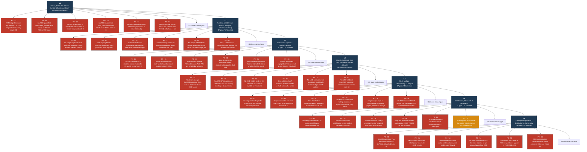

# Gap Flowgraph

*Generated by `render_gaps.py`. Node colour = priority tier; each layer shows its highest-scoring gaps.*

```mermaid
graph TD
  L0_L["<b>L0</b><br/>Silicon, RTOS, Real-Time Control & Functional Safety<br/>23 gaps / 35 checked"]
  C300["P0 · 81<br/>AMD edge hardware (Ryzen AI X100, Kria) shipped into a nearly empty SD"]
  L0_L --> C300
  C102["P0 · 54<br/>No AMD-published PREEMPT_RT reference config or RT-safe ROCm/NPU submi"]
  L0_L --> C102
  C104["P0 · 54<br/>No AMD-maintained or FPGA-offloaded EtherCAT master integrated with th"]
  L0_L --> C104
  C106["P0 · 54<br/>No AMD-maintained ros2_control hardware interface for FPGA fabric or E"]
  L0_L --> C106
  C209["P0 · 54<br/>No AMD-maintained static partitioning hypervisor or mixed-criticality "]
  L0_L --> C209
  C301["P0 · 54<br/>FPGA real-time control loop is not callable from ROS 2 or Python — las"]
  L0_L --> C301
  L0_more["+17 lower-ranked gaps"]
  L0_L --> L0_more
  L1_L["<b>L1</b><br/>Runtime & Middleware (ROS 2, transport, inference runtime)<br/>47 gaps / 67 checked"]
  L0_L --- L1_L
  C009["P0 · 81<br/>No single edge inference optimizer spanning Ryzen AI NPU Radeon iGPU a"]
  L1_L --> C009
  C028["P0 · 81<br/>No first-party ROS 2 detection nodes with AMD-published accuracy and t"]
  L1_L --> C028
  C033["P0 · 81<br/>No end-to-end GPU-accelerated manipulation reference workflow bringup "]
  L1_L --> C033
  C042["P0 · 81<br/>No low-latency sensor-to-inference streaming graph framework with zero"]
  L1_L --> C042
  C120["P0 · 81<br/>No drop-in GPU/FPGA-accelerated replacement for the standard image_pro"]
  L1_L --> C120
  C124["P0 · 81<br/>MLC-LLM has no CI publishing AMD artifacts for LeRobot VLA models"]
  L1_L --> C124
  L1_more["+41 lower-ranked gaps"]
  L1_L --> L1_more
  L2_L["<b>L2</b><br/>Simulation, Physics & Motion Planning<br/>26 gaps / 36 checked"]
  L1_L --- L2_L
  C046["P0 · 81<br/>No AMD-backed GPU-resident massively parallel RL and IL environment fr"]
  L2_L --> C046
  C049["P0 · 81<br/>No GPU-resident rigid body and articulation solver maintained on ROCm,"]
  L2_L --> C049
  C050["P0 · 81<br/>Warp has no merged ROCm backend; AMD PRs are in flight but unlanded"]
  L2_L --> C050
  C058["P0 · 81<br/>No real-capture-to-simulation neural reconstruction pipeline that feed"]
  L2_L --> C058
  C137["P0 · 81<br/>Upstream perf investment has moved to MJX-Warp which is NVIDIA-only le"]
  L2_L --> C137
  C141["P0 · 81<br/>AMD is technically engaged with Genesis but absent from its Robotics P"]
  L2_L --> C141
  L2_more["+20 lower-ranked gaps"]
  L2_L --> L2_more
  L3_L["<b>L3</b><br/>Models, Policies & Data (VLA, foundation models, datasets)<br/>34 gaps / 35 checked"]
  L2_L --- L3_L
  C159["P0 · 81<br/>Upstream openpi JAX/CUDA training stack has no ROCm build so AMD users"]
  L3_L --> C159
  C160["P0 · 81<br/>No AMD GPU in upstream LeRobot CI so ROCm-only breakages ship unnotice"]
  L3_L --> C160
  C170["P0 · 81<br/>No AMD model cards in the LeRobot hub — AMD is invisible at the develo"]
  L3_L --> C170
  C294["P0 · 81<br/>Zero published VLA inference Hz benchmarks on AMD silicon; the action-"]
  L3_L --> C294
  C064["P0 · 54<br/>No AMD-runnable world foundation model path; Cosmos ships CUDA-optimiz"]
  L3_L --> C064
  C157["P0 · 54<br/>No AMD-validated OpenVLA training or inference recipe, so the most-cit"]
  L3_L --> C157
  L3_more["+28 lower-ranked gaps"]
  L3_L --> L3_more
  L4_L["<b>L4</b><br/>Fleet, MLOps, Observability & Lifecycle<br/>17 gaps / 45 checked"]
  L3_L --- L4_L
  C290["P0 · 81<br/>No integrated VLA-specific safety-gated MLOps and lifecycle platform e"]
  L4_L --> C290
  C291["P0 · 81<br/>No product unifies per-joint latency, Hz, VLA action-drift and model p"]
  L4_L --> C291
  C293["P0 · 81<br/>Zero RocProfiler integration exists anywhere in the robotics or AI obs"]
  L4_L --> C293
  C087["P0 · 54<br/>No ROCm-accelerated routing or decision-optimization solver; only CPU "]
  L4_L --> C087
  C086["P0 · 36<br/>No packaged edge AI microservice framework (ingest, inference, storage"]
  L4_L --> C086
  C179["P0 · 36<br/>No ROCm-aware ROS 2 tracing that correlates GPU and NPU kernel timelin"]
  L4_L --> C179
  L4_more["+11 lower-ranked gaps"]
  L4_L --> L4_more
  L5_L["<b>L5</b><br/>Certification, Standards & Compliance<br/>21 gaps / 32 checked"]
  L4_L --- L5_L
  C256["P0 · 81<br/>No safety-certifiable RTOS image or certification artifact package tha"]
  L5_L --> C256
  C302["P0 · 81<br/>No functional-safety certification covers AMD AI-inference/XDNA tiles "]
  L5_L --> C302
  C182["P0 · 36<br/>No formal runtime safety-envelope monitor mapped onto AMD lockstep R5F"]
  L5_L --> C182
  C243["P0 · 36<br/>No public evidence of AMD participation in ISO TC 299 for the humanoid"]
  L5_L --> C243
  C304["P0 · 36<br/>The humanoid safety standard is still at committee draft — participati"]
  L5_L --> C304
  C092["P1 · 27<br/>No integrated AI-compute-plus-safety-island robotics SoC or safety-cer"]
  L5_L --> C092
  L5_more["+15 lower-ranked gaps"]
  L5_L --> L5_more
  L6_L["<b>L6</b><br/>Developer Experience, Distribution & Community<br/>26 gaps / 29 checked"]
  L5_L --- L6_L
  C189["P0 · 81<br/>No AMD-published VLA policy checkpoints or LeRobot datasets despite an"]
  L6_L --> C189
  C306["P0 · 81<br/>No CI publishes prebuilt robot-policy wheels for AMD targets"]
  L6_L --> C306
  C185["P0 · 54<br/>rosdistro carries nvidia-cuda, nvidia-cuda-dev and nvidia-cudnn keys b"]
  L6_L --> C185
  C186["P0 · 54<br/>No AMD-maintained ROS 2 release pipeline or apt channel publishing ROC"]
  L6_L --> C186
  C188["P0 · 54<br/>Zero AMD, Xilinx, Kria or ROCm repositories appear in the ROS 2 distri"]
  L6_L --> C188
  C269["P0 · 54<br/>AMD ships robotics compute boards but no complete reference mobile rob"]
  L6_L --> C269
  L6_more["+20 lower-ranked gaps"]
  L6_L --> L6_more

  style L0_L fill:#1f3a54,stroke:#0d1f2d,color:#ffffff
  style L1_L fill:#1f3a54,stroke:#0d1f2d,color:#ffffff
  style L2_L fill:#1f3a54,stroke:#0d1f2d,color:#ffffff
  style L3_L fill:#1f3a54,stroke:#0d1f2d,color:#ffffff
  style L4_L fill:#1f3a54,stroke:#0d1f2d,color:#ffffff
  style L5_L fill:#1f3a54,stroke:#0d1f2d,color:#ffffff
  style L6_L fill:#1f3a54,stroke:#0d1f2d,color:#ffffff
  style C300 fill:#c0392b,stroke:#333,color:#ffffff
  style C102 fill:#c0392b,stroke:#333,color:#ffffff
  style C104 fill:#c0392b,stroke:#333,color:#ffffff
  style C106 fill:#c0392b,stroke:#333,color:#ffffff
  style C209 fill:#c0392b,stroke:#333,color:#ffffff
  style C301 fill:#c0392b,stroke:#333,color:#ffffff
  style C009 fill:#c0392b,stroke:#333,color:#ffffff
  style C028 fill:#c0392b,stroke:#333,color:#ffffff
  style C033 fill:#c0392b,stroke:#333,color:#ffffff
  style C042 fill:#c0392b,stroke:#333,color:#ffffff
  style C120 fill:#c0392b,stroke:#333,color:#ffffff
  style C124 fill:#c0392b,stroke:#333,color:#ffffff
  style C046 fill:#c0392b,stroke:#333,color:#ffffff
  style C049 fill:#c0392b,stroke:#333,color:#ffffff
  style C050 fill:#c0392b,stroke:#333,color:#ffffff
  style C058 fill:#c0392b,stroke:#333,color:#ffffff
  style C137 fill:#c0392b,stroke:#333,color:#ffffff
  style C141 fill:#c0392b,stroke:#333,color:#ffffff
  style C159 fill:#c0392b,stroke:#333,color:#ffffff
  style C160 fill:#c0392b,stroke:#333,color:#ffffff
  style C170 fill:#c0392b,stroke:#333,color:#ffffff
  style C294 fill:#c0392b,stroke:#333,color:#ffffff
  style C064 fill:#c0392b,stroke:#333,color:#ffffff
  style C157 fill:#c0392b,stroke:#333,color:#ffffff
  style C290 fill:#c0392b,stroke:#333,color:#ffffff
  style C291 fill:#c0392b,stroke:#333,color:#ffffff
  style C293 fill:#c0392b,stroke:#333,color:#ffffff
  style C087 fill:#c0392b,stroke:#333,color:#ffffff
  style C086 fill:#c0392b,stroke:#333,color:#ffffff
  style C179 fill:#c0392b,stroke:#333,color:#ffffff
  style C256 fill:#c0392b,stroke:#333,color:#ffffff
  style C302 fill:#c0392b,stroke:#333,color:#ffffff
  style C182 fill:#c0392b,stroke:#333,color:#ffffff
  style C243 fill:#c0392b,stroke:#333,color:#ffffff
  style C304 fill:#c0392b,stroke:#333,color:#ffffff
  style C092 fill:#d68910,stroke:#333,color:#ffffff
  style C189 fill:#c0392b,stroke:#333,color:#ffffff
  style C306 fill:#c0392b,stroke:#333,color:#ffffff
  style C185 fill:#c0392b,stroke:#333,color:#ffffff
  style C186 fill:#c0392b,stroke:#333,color:#ffffff
  style C188 fill:#c0392b,stroke:#333,color:#ffffff
  style C269 fill:#c0392b,stroke:#333,color:#ffffff
```

