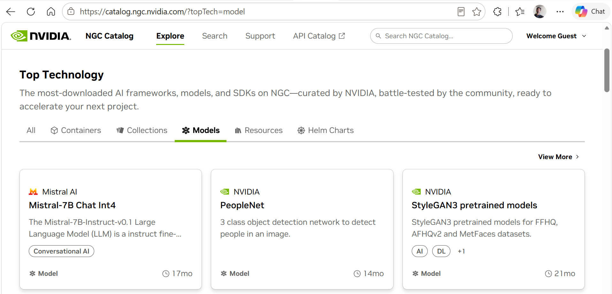
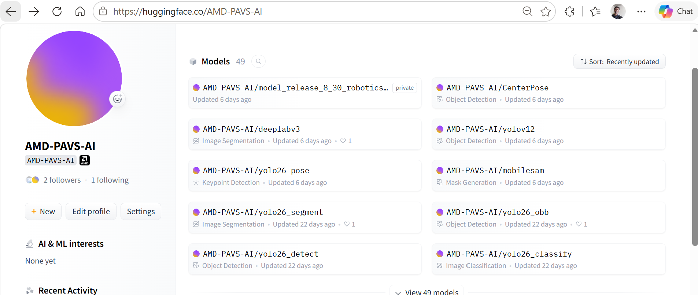
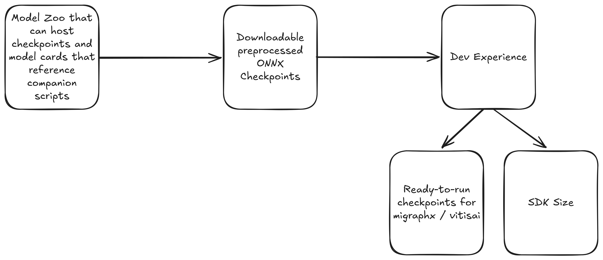

<!-- _class: lead -->

# Why a Model Zoo?

## From a 100 GB Tarball to an Off-the-Shelf Product Experience

**What PAVS needs from a Model Zoo — and what we must not turn it into**

---

<!-- _class: small -->

## 1 · The Off-the-Shelf Promise

**What an application developer actually wants**

- Download a model → **start building the application today**
- No knowledge of layers, kernels, quantization, or backends
- Just a **prepackaged model, best-suited to the task**, ready to run on AMD hardware

The developer knows the **inputs and outputs** of the model and builds his product around them — nothing more.

**The experience we are selling**

  
<strong style="color:#00bcd4;">Pick a task</strong> — detect / classify / segment / LLM

  
&#8595;

  
<strong style="color:#00bcd4;">Download the packaged model</strong> — already optimized

  
&#8595;

  
<strong style="color:#4caf50;">Build the product</strong> — runs on CPU · GPU · NPU

A model zoo is what turns <strong>"here are some weights"</strong> into <strong>"here is a product you can ship."</strong>

---

<!-- _class: small -->

## 2 · NVIDIA's Blueprint: NGC &#8596; Isaac ROS

NGC Catalog — curated, prepackaged models (PeopleNet, Mistral-7B Int4, …)

**The pattern that makes it work**

- **NGC Catalog** hosts the ready-to-run models
- **Isaac ROS** consumes them directly into robotics pipelines
- The developer pulls a model and it *just runs* — no export, no tuning

**AMD needs exactly this pairing:**
a **zoo** that hosts optimized models + an **SDK / robotics stack** that consumes them off-the-shelf.

  
<strong style="color:#3498db;">AMD Model Zoo</strong> hosts weights

  
&#8596;

  
<strong style="color:#4caf50;">PAI SDK / AARTS</strong> consumes them

---

<!-- _class: small -->

## 3 · The Tarball Problem

**How we ship today**

- **Every model** is packaged into the release tarball
- Add optimized variants of CNNs **and** LLMs and it balloons fast
- Realistically **100+ GB** — and growing with every new variant

Every user carries **the entire zoo on their disk** — even if they only ever use a couple of CNNs.

  

    
Monolithic Tarball · 100+ GB

    

      YOLOv12
      YOLO26 fp16/int8
      MobileSAM
      CenterPoint
      Llama-3 int4
      SmolVLA
      + every variant
    

  

  
&#8595; forced onto every disk

  
User who only wanted <strong style="color:#4caf50;">2 CNNs</strong> still pays the full 100+ GB

A zoo fixes this: <strong>pull only the model you need</strong>, keep the SDK lean.

---

<!-- _class: smallest -->

## 4 · Save the Optimization Stages — Don't Ship Them Raw

### AIG hands us a PyTorch model — the zoo stores every optimized artifact so the customer never has to

  
<strong style="color:#b07cc6;">AIG PyTorch model</strong> research checkpoint

  
&#8594;

  
<strong style="color:#00bcd4;">Export to ONNX</strong> MIGraphX · Vitis-AI

  
&#8594;

  
<strong style="color:#00bcd4;">Quantize</strong> AWQ · INT4 + calibration

  
&#8594;

  
<strong style="color:#00bcd4;">NPU flow</strong> kernel-level opt

  
&#8594;

  
<strong style="color:#4caf50;">Customer usage</strong> just downloads

**The zoo stores every stage as a downloadable artifact**

- PyTorch → ONNX → MIGraphX / Vitis-AI graphs
- AWQ-quantized ONNX · INT4 + calibration data
- Kernel-level optimized NPU builds

**If we don't save these stages,** the end customer has to run PyTorch &#8594; ONNX &#8594; INT4 **on his own disk at usage time** — slow toolchains, calibration data, hours of work. **Poor user experience.**

**This is why NVIDIA & Qualcomm pre-bake artifacts**

- NVIDIA NGC — ready-to-run per target
- **Qualcomm AI Hub** — per-backend precompiled models
- We are building a zoo **close to the Qualcomm model** — graphics not there yet, but the structure is live:

AMD-PAVS-AI on Hugging Face — 49 models, per-task

---

<!-- _class: small -->

## 5 · How the Zoo Delivers a Great User Experience

Model cards reference companion scripts · downloadable preprocessed ONNX checkpoints · <strong>ready-to-run for MIGraphX / Vitis-AI</strong> — and a <strong style="color:#4caf50;">lean SDK</strong> because weights live in the zoo, not the tarball.

---

<!-- _class: small -->

## 6 · Two Kinds of Users — Two Kinds of Products

AIG Git + Model Zoo serves…

**The Research Engineer**

- Knows the **nitty-gritty** of the model internals
- Rewires layers, swaps operators, debugs graphs
- Cares *which layer breaks*, *which workflow is GPU-heavy*, *which lighter variant to substitute*
- Works **inside** the model

Audience: people who build and modify models.

PAVS serves…

**The Application Engineer**

- Uses AI models as **black boxes**
- Knows only the **inputs and outputs**
- Does **not** need to know which layer breaks or which variant is lighter
- Builds the **application around** the model

Audience: people who ship products using models.

Our zoo brings a <strong>different kind of user</strong> onto AMD silicon — and needs to be shaped for <strong>them</strong>, not for the researcher.

---

<!-- _class: small -->

## 7 · What PAVS Expects From a Model Zoo

**Just a storage space — like Hugging Face**

- We **don't care who owns or maintains it** — could be AMD central-wide infrastructure
- One requirement: it **hosts weights and serves them to customers**

**What we do need: operational flexibility**

- Freedom to **create directories** / structure as our workflows demand
- **Store the weights** for every optimization stage
- **Make them public** for customer consumption on our schedule

  
Model Zoo = Storage + Freedom

  

    
&#128193; Create our own directory structure

    
&#128190; Store weights for every stage

    
&#127760; Publish for customers directly

    
&#128274; Control what is public, and when

  

Think <strong>Hugging Face for AMD</strong>: a backing store we operate freely — not a system we must conform to.

---

<!-- _class: smallest -->

## 8 · What We Should NOT Do

### The initial promise: convert research code into **vertical software** — a zoo must not reverse that

**The anti-pattern**

If AIG **hosts** the zoo and mandates we place our models in it:

1. To appear on **their dashboard**, we must write research code that **fits their git repo**
2. We end up rebuilding a **research setup** — **not vertical software**
3. This turns our SDK into a mirror of **their repo and dashboard**

This direction **nullifies the value-add** that Physical AI & Vertical Software brings — the exact opposite of our founding promise.

**The right shape**

- Our job (per the SW-stack promise) is **Research Desk → Vertical Software**
- Fitting AIG's repo/dashboard is **book-keeping**, not a **customer-facing** deliverable

  
<strong style="color:#4caf50;">Vertical software</strong> — customer-facing, product-grade

  
&#9650; keep on top

  
<strong style="color:#aaa;">AIG repo / dashboard sync</strong> — do it as <em>book-keeping</em>, if at all

**If it must be done, do it as book-keeping** — never let it turn the SDK into a customer-facing clone of the research repo.

---

<!-- _class: lead -->

# The Ask

## A model zoo that is **storage + operational freedom** — so PAVS ships an **off-the-shelf, product-grade** experience on AMD silicon

**Host the optimized artifacts · keep the SDK lean · serve the application engineer · stay vertical software**
